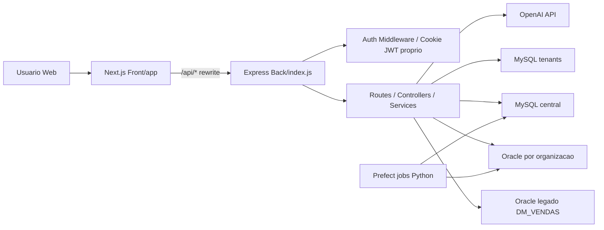

# Relatorio completo do projeto

Data da analise: 2026-07-02  
Escopo: leitura estatica do repositorio `GestaoMetas`, sem alteracao de codigo.  
Observacao: valores reais de `.env` nao foram expostos; foram coletados apenas nomes de variaveis.

## 1. Resumo executivo

O projeto e uma plataforma web de inteligencia comercial chamada SIP / Gestao de Metas. Ela apoia gerentes, vendedores, administradores, superadministradores e industria/parceiros no acompanhamento de metas, ranking, carteira, campanhas, desafios, feed interno e consultas de cliente.

O problema principal resolvido e dar visibilidade operacional e gerencial sobre performance comercial: quem esta batendo meta, onde existe oportunidade, quais clientes devem ser atacados, quais campanhas estao rodando e como manter o time engajado.

Estagio aparente: **MVP/beta avancado**. Ha muitos modulos funcionais, Docker, autenticacao propria, multi-organizacao, Oracle/MySQL e UI extensa. Ainda nao parece producao madura porque faltam testes automatizados, ha rotas importantes sem `requireAuth`, ha arquivos muito grandes, `ignoreBuildErrors: true` no Next e varias regras sensiveis dependem de dados enviados pelo cliente.

Principais pontos fortes:

| Ponto | Evidencia |
|---|---|
| Separacao clara entre frontend e backend | `Front/` com Next.js e `Back/` com Express |
| Dominio de negocio rico | rotas para ranking, vendedor, area de ataque, feed, desafios, ativacao e industria |
| Autenticacao com cookie HTTP-only | `Back/src/auth/token.js` |
| Multi-tenant MySQL e Oracle por organizacao | `Back/src/db/mysql-tenants.js`, `Back/src/db/oracle-tenants.js` |
| Criptografia de segredos de organizacao | `Back/src/security/secrets.js` |
| Docker para frontend/backend/MySQL | `docker-compose.yml`, `Front/Dockerfile`, `Back/Dockerfile` |

Maiores riscos tecnicos:

| Risco | Severidade | Evidencia |
|---|---:|---|
| Rotas de negocio sem autenticacao forte | Alta | `Back/src/routes/feed.js`, `Back/src/routes/desafios.js`, `Back/src/routes/ativacaoClientes.js`, `Back/src/routes/objetivoVendedor.js`, `Back/src/routes/investigarCliente.js`, `Back/src/routes/areaAtaque.js`, `Back/src/routes/alertasRanking.js` |
| Escopo de usuario aceito via query/body | Alta | `Back/src/controllers/feedController.js`, `Back/src/controllers/ativacaoClientesController.js`, `Back/src/controllers/desafiosController.js` |
| Build TypeScript ignora erros | Alta | `Front/next.config.mjs` |
| Ausencia de suite de testes | Alta | `package.json` nao define `test`; apenas `Back/test-oracle.js` |
| Arquivos grandes e acoplados | Media | `Front/app/vendedor/page.tsx`, `Back/src/services/desafios/desafiosService.js` |
| Senhas iniciais padrao | Media/Alta | `Back/src/db/mysql-tenants.js`, `Back/src/routes/superadmin.js`, `Front/app/admin/page.tsx` |

Proximos passos mais importantes:

1. Exigir `requireAuth` e escopo pelo token em todas as rotas de negocio.
2. Remover `typescript.ignoreBuildErrors`.
3. Criar testes minimos de autenticacao/autorizacao e smoke tests de rotas criticas.
4. Revisar senhas iniciais e fluxo de primeira troca obrigatoria.
5. Separar services e paginas grandes por casos de uso.

## 2. Visao geral do projeto

Proposta do sistema: painel comercial para gestao de metas, ranking, oportunidades, ativacao de clientes, desafios/campanhas, feed interno e portal de industria.

Publico-alvo provavel:

| Perfil | Objetivo no sistema |
|---|---|
| `SUPERADMIN` | cadastrar organizacoes, credenciais Oracle, tenants MySQL e gerentes |
| `ADMIN` | administrar organizacoes e usuarios em escopo administrativo |
| `GERENTE` | acompanhar time, ranking, desafios, feed, usuarios e ativacao |
| `VENDEDOR` | acompanhar propria meta, carteira, desafios, oportunidades e meta de vida |
| `INDUSTRIA` | acompanhar desempenho de marca/campanha |

Principais funcionalidades encontradas:

- Login/logout e troca de senha.
- Dashboard do gerente.
- Dashboard do vendedor.
- Ranking mensal e diario.
- Area de ataque por RFV.
- Investigacao de cliente por CPF/CNPJ/nome.
- Radar de vendas.
- Assistente de vendas com OpenAI.
- Central de ativacao de clientes com templates e WhatsApp.
- Feed interno com posts, curtidas, comentarios, destaque e mensagens privadas.
- Desafios/bonus/campanhas comerciais.
- Meta de vida e perfil do vendedor.
- Gestao de usuarios.
- Gestao de organizacoes e tenants.
- Portal da industria.
- Jobs Prefect para validacao de organizacoes.

Jornada principal:

1. Usuario acessa `/login`.
2. Backend autentica em MySQL central ou tenant.
3. Front salva dados basicos em `sessionStorage`; backend seta cookie HTTP-only.
4. Usuario e redirecionado conforme role: `/admin`, `/admin/organizacoes`, `/dashboard`, `/vendedor` ou `/industria`.
5. Front consome `/api/*`; `Front/next.config.mjs` reescreve para o backend.
6. Backend consulta Oracle legado/global ou Oracle da organizacao, e MySQL central/tenant para auth e administracao.

## 3. Stack utilizada

| Tecnologia | Onde aparece | Funcao | Uso aparente | Riscos/inconsistencias |
|---|---|---|---|---|
| JavaScript/TypeScript | `Back/**/*.js`, `Front/**/*.tsx` | Linguagens principais | JS no backend, TS/TSX no frontend | Backend sem tipagem estatica |
| Next.js 16 | `Front/package.json`, `Front/app` | Frontend App Router | Bem usado para paginas e API route pontual | `ignoreBuildErrors: true` |
| React 19 | `Front/package.json` | UI | Uso amplo com hooks/componentes | Paginas muito grandes |
| Tailwind CSS 4 | `Front/package.json`, `Front/app/globals.css` | Estilo | UI customizada extensa | Paleta escura/verde muito dominante |
| Radix/shadcn | `Front/components/ui`, `components.json` | Componentes base | Biblioteca consistente | Alguns componentes de negocio ainda muito acoplados |
| Express 5 | `Back/package.json`, `Back/index.js` | API REST | Roteamento simples | Rotas sem middleware uniforme |
| Oracle `oracledb` | `Back/src/db/oracle*.js` | DW/operacional principal | Pool legado e conexoes por tenant | Forte dependencia externa; migrations Oracle manuais |
| MySQL `mysql2` | `Back/src/db/mysql*.js` | auth central/tenant | Multi-tenant e schema auto-criado | Credenciais e grants precisam hardening |
| bcrypt | `Back/src/routes/auth.js`, `superadmin.js` | Hash de senha | Uso correto para comparacao/hash | Minimo de senha baixo em alguns fluxos |
| Cookie parser | `Back/index.js` | Leitura de cookie auth | Integrado ao token proprio | Nem todas as rotas usam auth |
| OpenAI API via fetch | `Back/src/routes/assistenteVendas.js` | Assistente de vendas | Fallback sem chave | Sem cliente oficial; depende de env |
| ExcelJS | `Back/src/services/ativacaoClientesService.js` | Gerar planilhas | Usado na ativacao | Pode gerar arquivos grandes em memoria |
| Docker | `docker-compose.yml`, Dockerfiles | Deploy/local | Front, Back e MySQL | Compose depende de `Back/.env.docker` |
| Prefect/Python | `Back/jobs` | Jobs de diagnostico | Isolado | Sem integracao clara no compose |
| Testes | `Back/test-oracle.js` | Smoke Oracle | Pontual | Nao ha suite automatizada |

## 4. Estrutura de pastas

```text
GestaoMetas/
├─ Back/
│  ├─ index.js
│  ├─ src/
│  │  ├─ auth/
│  │  ├─ controllers/
│  │  ├─ db/
│  │  ├─ middleware/
│  │  ├─ routes/
│  │  ├─ security/
│  │  └─ services/
│  ├─ jobs/
│  └─ sql/
├─ Front/
│  ├─ app/
│  ├─ components/
│  ├─ hooks/
│  ├─ lib/
│  ├─ public/
│  └─ styles/
├─ docker-compose.yml
└─ README.md
```

| Pasta | Responsabilidade | Principais arquivos | Clareza |
|---|---|---|---|
| `Back/src/routes` | Endpoints Express | `auth.js`, `rankingVendedores.js`, `superadmin.js`, `desafios.js` | Clara, mas protecao inconsistente |
| `Back/src/controllers` | Adaptacao HTTP para services | `feedController.js`, `desafiosController.js` | Clara onde existe; varias rotas ainda fazem regra diretamente |
| `Back/src/services` | Regras de negocio e queries | `ativacaoClientesService.js`, `objetivoVendedorService.js`, `desafiosService.js` | Forte, mas alguns services muito grandes |
| `Back/src/db` | Oracle/MySQL/conexao/tenants | `oracle.js`, `oracle-tenants.js`, `mysql-tenants.js` | Boa separacao |
| `Back/sql` | DDL Oracle/MySQL | `ddl_gestao_metas.sql`, schemas MySQL | Util, mas sem migrations versionadas |
| `Back/jobs` | Prefect jobs | `prefect_flows.py`, `run_prefect.py` | Isolado e compreensivel |
| `Front/app` | Rotas App Router | `dashboard/page.tsx`, `vendedor/page.tsx`, `admin/page.tsx` | Rotas claras, arquivos grandes |
| `Front/components` | UI e modulos | `dashboard`, `feed`, `challenges`, `ativacao-clientes` | Boa organizacao por dominio |
| `Front/hooks` | Estado/consumo API | `useFeed.ts`, `useChallenges.ts` | Boa ideia; alguns hooks carregam escopo sensivel do cliente |
| `Front/lib` | Tipos e clientes | `user-session.ts`, `challenges.ts`, `activation-service.ts` | Centraliza utilitarios |

## 5. Arquitetura geral

Tipo de arquitetura: **monorepo informal frontend/backend**, com frontend Next.js consumindo API Express via rewrite `/api/*`.

Separacao:

- Frontend: Next.js App Router, paginas client-side, componentes e hooks.
- Backend: Express REST, controllers/services/routes.
- Banco principal de negocio: Oracle.
- Banco de autenticacao/tenants: MySQL.
- Jobs: Python/Prefect para diagnostico.
- Integracoes externas: OpenAI API, WhatsApp links, Oracle Instant Client, Vercel Analytics, avatar externo `ui-avatars.com`.

Fluxo de dados:

1. Browser chama `Front/app/*`.
2. Pagina/hook chama `/api/...`.
3. `next.config.mjs` reescreve para `http://localhost:3001/api/...` ou `NEXT_PUBLIC_API_URL`.
4. Express aplica middlewares globais (`cors`, JSON, cookies).
5. Algumas rotas aplicam `requireAuth`; outras nao.
6. Services consultam Oracle legado/global, Oracle por tenant ou MySQL.
7. Resposta volta para o frontend e atualiza estado client-side.

Diagrama Mermaid:



Pontos de acoplamento/gargalos:

- Front depende de `sessionStorage` para role, nome, empresa e vendedor.
- Backend tem varias rotas acopladas diretamente a tabelas/views `DM_VENDAS`.
- `queryOracleByEmpresaId` abre conexao por chamada, diferente do pool legado.
- Services grandes misturam validacao, SQL, normalizacao e regra.
- Sem cache aparente para consultas pesadas de dashboard/ranking.

## 6. Fluxo de execucao

Aplicacao inicia assim:

- Backend: `Back/index.js` importa dotenv, Oracle Client, cria Express, registra rotas e chama `ensureCentralSchema()` antes de `app.listen`.
- Frontend: `Front/app/layout.tsx` configura fontes, providers de notificacao e analytics; paginas em `Front/app`.
- Docker: `docker-compose.yml` sobe `frontend`, `backend` e `mysql`.

Fluxo de requisicao:

1. Browser chama `/api/rota`.
2. Next rewrite manda para backend.
3. Express processa JSON ate `8mb`, cookies e CORS.
4. Rota decide se exige `requireAuth`.
5. Service executa query Oracle/MySQL.

Fluxo de autenticacao:

1. `POST /api/login` em `Back/src/routes/auth.js`.
2. Busca usuario em `usuarios_auth` central.
3. Se nao achar, busca em tenants ativos.
4. Compara `senha` com `bcrypt.compare`.
5. Emite token proprio formato JWT HS256 em `Back/src/auth/token.js`.
6. Seta cookie HTTP-only `sip_auth` por padrao.
7. Front salva payload publico em `sessionStorage` via `Front/lib/user-session.ts`.
8. `requireAuth` valida cookie/bearer e reconsulta usuario/token_version.

Fluxo de banco:

- Oracle legado: `Back/src/db/oracle.js` cria pool com `DB_USER`, `DB_PASSWORD`, `DB_CONNECT_STRING`.
- Oracle tenant: `Back/src/db/oracle-tenants.js` busca credenciais em `organizacoes_auth`, decripta e conecta.
- MySQL central: `Back/src/db/mysql.js`.
- MySQL tenants: `Back/src/db/mysql-tenants.js` cria database `org_<id>_<slug>` e tabela `usuarios_auth`.

Onde ficam regras de negocio:

- Ranking/vendedor/area/radar: parte em routes.
- Feed, desafios, ativacao, objetivo: majoritariamente em services.
- Auth/usuarios/superadmin: routes e services de auth.

## 7. Funcionalidades implementadas

| Funcionalidade | Objetivo | Arquivos | Status aparente | Riscos/melhorias |
|---|---|---|---|---|
| Login/logout | Autenticar usuarios | `Back/src/routes/auth.js`, `Back/src/auth/token.js`, `Front/app/login/page.tsx` | Parcial/boa base | Fortalecer senha, rate limit, auditoria |
| Troca de senha | Usuario troca senha | `auth.js`, `usuarios.js`, `Front/app/perfil/page.tsx` | Parcial | Dois endpoints parecidos; padronizar |
| Superadmin organizacoes | Cadastrar org, Oracle, tenant | `Back/src/routes/superadmin.js`, `Back/src/db/mysql-tenants.js` | Completo/frágil | Senhas padrao, operacoes destrutivas, logs |
| Admin organizacoes | CRUD via controller | `Back/src/routes/organizacoes.js`, `organizacoesService.js` | Parcial | Duas abordagens paralelas a superadmin |
| Ranking | Ranking mensal/diario | `rankingVendedores.js`, `Front/app/dashboard/page.tsx` | Completo | Depende de views Oracle |
| Dashboard vendedor | Metas, oportunidades | `vendedor.js`, `Front/app/vendedor/page.tsx` | Completo/frágil | Pagina grande; escopo via URL |
| Area de ataque | Priorizar carteira RFV | `areaAtaque.js`, `Front/app/area-ataque/page.tsx` | Parcial | Rota sem auth |
| Investigar cliente | Busca cliente detalhada | `investigarCliente.js`, `Front/app/investigar-cliente/page.tsx` | Parcial | Exposicao de CPF/CNPJ sem auth |
| Radar vendas | Tendencias | `radarVendas.js`, `RadarVendas.tsx` | Parcial | Protegido por auth, mas consultas pesadas |
| Assistente vendas | Sugestoes via regras/OpenAI | `assistenteVendas.js` | Parcial | OpenAI direto; tratar custos/limites |
| Ativacao clientes | Segmentos, preview, Excel/WhatsApp | `ativacaoClientes*`, `Front/app/ativacao-clientes/page.tsx` | Completo/frágil | Sem auth no backend; escopo client-side |
| Feed | Posts/curtidas/comentarios | `feed*`, `Front/app/feed/page.tsx` | Completo/frágil | Identidade via query/body |
| Desafios | Campanhas/desafios/bonus | `desafios*`, `Front/app/desafios/page.tsx` | Completo/frágil | Sem auth no backend |
| Meta de vida | Objetivos pessoais do vendedor | `objetivoVendedor*`, `LifeGoalWizard.tsx` | Parcial | Sem auth no backend |
| Industria | Login e dashboard por marca | `industria.js`, `Front/app/industria/page.tsx` | Parcial | Dashboard por marca sem token |
| Upload foto | Avatar usuario | `usuarios.js`, `Front/app/perfil/page.tsx` | Parcial | Valida MIME/tamanho, mas nao assinatura real |
| Jobs diagnostico | Validar orgs/views | `Back/jobs` | Parcial | Nao integrado ao deploy principal |

## 8. Rotas, telas e navegacao

### Telas frontend

| Rota | Finalidade | Componentes/dados | Problemas possiveis |
|---|---|---|---|
| `/` | Landing page | `Front/app/page.tsx`, ranking via hook | Chama ranking que exige auth; pode falhar em publico |
| `/como-funciona` | Pagina explicativa | `Front/app/como-funciona/page.tsx` | Arquivo grande |
| `/login` | Login | `/api/login` | Lembrar de mim nao implementado de fato |
| `/alterar-senha` | Troca senha temporaria | `/api/alterar-senha` | Depende de cookie ja setado |
| `/dashboard` | Gerente | `/api/ranking-vendedores`, radar, alertas | Checagem de role so client-side antes das APIs |
| `/vendedor` | Vendedor | `/api/vendedor/:id`, oportunidades, desafios | Arquivo muito grande |
| `/area-ataque` | Carteira priorizada | `/api/area-ataque/:id`, assistente | Backend da area sem auth |
| `/investigar-cliente` | Busca cliente | `/api/investigar-cliente` | Backend sem auth |
| `/ativacao-clientes` | Campanhas WhatsApp | `/api/ativacao-clientes/*` | Backend sem auth |
| `/feed` | Feed interno | `/api/feed/*` | Backend usa identidade enviada pelo cliente |
| `/desafios` | Gerente cria desafios | `/api/desafios/*` | Backend sem auth |
| `/vendedor/desafios` | Vendedor ve desafios | `/api/vendedor/:sk/desafios` | Backend sem auth |
| `/vendedor/minha-meta-de-vida` | Meta pessoal | `/api/objetivo-vendedor/*` | Backend sem auth |
| `/perfil` | Perfil/foto/senha | `/api/usuarios/*` | Mais protegido que outros modulos |
| `/usuarios` | Gestao de usuarios | `/api/usuarios/gerenciamento` | Protegido por auth |
| `/admin` | Superadmin | `/api/superadmin/*` | Backend protegido por role |
| `/admin/organizacoes` | Admin orgs | `/api/organizacoes/*` | Backend protegido por ADMIN/SUPERADMIN |
| `/industria` | Portal industria | `/api/login-industria`, `/api/industria/dashboard` | Dashboard por marca sem auth |

### Endpoints backend

| Grupo | Rotas principais | Protecao aparente |
|---|---|---|
| Auth | `/login`, `/logout`, `/alterar-senha`, `/resetar-senhas-temporarias` | Parcial; reset protegido |
| Superadmin | `/superadmin/*` | `router.use(requireAuth)` + role manual |
| Organizacoes | `/organizacoes/*` | `requireAuth` + `requireRole("ADMIN","SUPERADMIN")` |
| Usuarios | `/usuarios/perfil`, `/usuarios/gerenciamento`, upload, senha | Protegido, exceto foto publica e CPF bloqueado |
| Ranking | `/ranking-vendedores` | `requireAuth` |
| Vendedor | `/vendedor/:sk`, `/vendedor-panorama/:sk`, oportunidades | `requireAuth` |
| Radar | `/radar-vendas` | `requireAuth` |
| Assistente | `/assistente-vendas` | `requireAuth` |
| Area ataque | `/area-ataque/:vendedor_id` | Sem `requireAuth` |
| Alertas | `/alertas-ranking` | Sem `requireAuth` |
| Investigar cliente | `/investigar-cliente` | Sem `requireAuth` |
| Feed | `/feed/*` | Sem `requireAuth`; usa query/body |
| Desafios | `/desafios/*`, `/vendedor/:sk/desafios*` | Sem `requireAuth` |
| Ativacao | `/ativacao-clientes/*`, `/templates-mensagens*` | Sem `requireAuth` |
| Objetivo/perfil vendedor | `/objetivo-vendedor*`, `/perfil-vendedor*` | Sem `requireAuth` aparente nas rotas |
| Industria | `/login-industria`, `/industria/dashboard` | Login separado; dashboard sem token |

## 9. APIs, controllers, services e handlers

| Item | Arquivo | Entrada | Saida | Validacoes/tratamento | Riscos |
|---|---|---|---|---|---|
| Auth token | `Back/src/auth/token.js` | usuario | token/cookie | exp, role, assinatura, secret min 32 | Implementacao propria; sem lib JWT madura |
| `requireAuth` | `Back/src/middleware/auth.js` | cookie/bearer | `req.auth` | reconsulta usuario e token_version | Bom, mas nao aplicado globalmente |
| Login | `Back/src/routes/auth.js` | login/senha | user publico + cookie | bcrypt, ativo | Sem rate limit |
| Superadmin | `Back/src/routes/superadmin.js` | CRUD orgs/gerentes | JSON | role `SUPERADMIN` | Arquivo grande; senha vendedor padrao |
| Ranking | `Back/src/routes/rankingVendedores.js` | modo, empresa_id | ranking | auth e escopo | Query sem paginacao |
| Vendedor | `Back/src/routes/vendedor.js` | sk_vendedor | painel/oportunidades | auth | Verificar se vendedor nao acessa outro sk |
| Feed | `Back/src/controllers/feedController.js`, `feedService.js` | usuario_id/nome/tipo/empresa | posts/comentarios | valida formato | Identidade nao vem do token |
| Ativacao | `ativacaoClientesController.js`, service | role/sk/empresa/id via request | segmentos, preview, Excel | valida negocio | Escopo client-side |
| Desafios | `desafiosController.js`, service | payload desafio/sk | desafios/progresso | valida negocio | Sem auth/role |
| Meta de vida | `objetivoVendedorController.js`, service | vendedor_id/payload | objetivo/perfil | valida negocio | Sem auth |
| Industria | `Back/src/routes/industria.js` | codigo/senha ou marca | sessao industria/dashboard | bcrypt no login | dashboard sem cookie/token |
| Jobs Prefect | `Back/jobs/*.py` | CLI/env | diagnosticos | retries Prefect | Depende de env e MySQL |

## 10. Banco de dados e persistencia

Banco utilizado:

- Oracle: principal fonte de dados comerciais e parte das tabelas de produto.
- MySQL: autenticacao central, organizacoes, tenants e diagnosticos.

Configuracao:

- Oracle legado: `DB_USER`, `DB_PASSWORD`, `DB_CONNECT_STRING`.
- Oracle por organizacao: `organizacoes_auth.oracle_*` criptografado por `APP_ENCRYPTION_KEY`.
- MySQL: `MYSQL_*` ou fallback `DB_*`.

Migrations:

- Existem DDLs em `Back/sql`, mas nao ha framework de migration versionado.
- `ensureCentralSchema()` cria/ajusta parte do MySQL automaticamente.

Entidades principais:

| Entidade | Banco | Finalidade | Campos principais | Relacionamentos | Riscos/melhoria |
|---|---|---|---|---|---|
| `usuarios_auth` | MySQL central/tenant | Auth usuarios | login, senha_hash, role, empresa_id, sk_vendedor, token_version | organizacao/tenant | Padronizar migration, senha inicial |
| `organizacoes_auth` | MySQL central | Empresas/tenants | nome, codigo, oracle_user, oracle_password, db_name | tenants MySQL/Oracle | Credenciais criptografadas; hardening de grants |
| `organizacoes_diagnosticos` | MySQL | Jobs de validacao | status, payload_json | organizacao | OK; limitar payload sensivel |
| `FEED_POSTS` | Oracle | Feed | usuario_id, mensagem, visibilidade | comentarios/curtidas | Falta auth forte |
| `FEED_COMENTARIOS` | Oracle | Comentarios | post_id, usuario_id, comentario | feed_posts | OK estrutural |
| `FEED_CURTIDAS` | Oracle | Curtidas | post_id, usuario_id | feed_posts | OK estrutural |
| `DESAFIOS_COMERCIAIS` | Oracle | Desafios/campanhas | titulo, status, periodo, aceite | metas/vendedores/progresso | Sem auth no endpoint |
| `DESAFIOS_COMERCIAIS_METAS` | Oracle | Metas de desafio | tipo_meta, meta_valor, config_json | desafio | Validar JSON |
| `DESAFIOS_COMERCIAIS_VENDEDORES` | Oracle | Participantes | id_desafio, sk_vendedor, status | desafio | Controle de acesso por sk |
| `OBJETIVOS_VENDEDOR` | Oracle | Meta de vida | sk_vendedor, valor, data_limite | vendedor | Sem auth no endpoint |
| `PERFIL_VENDEDOR` | Oracle | Perfil pessoal | renda, preferencias, salario | vendedor | Dados pessoais |
| `CAMPANHAS_ATIVACAO` | Oracle | Campanhas | segmento, mensagem, usuario | clientes/eventos/links | Sem auth no endpoint |
| Views ranking/RFV | Oracle | Dados analiticos | vendas/meta/ranking | fatos/dimensoes | Dependencia forte de DW |

Dados sensiveis:

- Credenciais Oracle em `.env` e `organizacoes_auth`.
- Hashes de senha em MySQL/Oracle.
- CPF/CNPJ de usuarios/clientes.
- Dados comerciais e faturamento.
- Possiveis mensagens privadas do feed.

## 11. Autenticacao e autorizacao

Como login funciona: `POST /api/login` busca usuarios no MySQL central ou tenants, compara bcrypt, gera token assinado e seta cookie HTTP-only.

Sessao/token: token proprio HS256 com `exp`, `role`, `empresa_id`, `sk_vendedor` e `token_version`. Cookie usa `httpOnly`, `sameSite` configuravel e `secure` em producao.

Usuario identificado: em rotas protegidas, `req.auth`; no frontend, `sessionStorage`. Em rotas nao protegidas, alguns controllers aceitam `usuario_id`, `empresa_id`, `role` no request.

Rotas protegidas: auth sensivel, superadmin, organizacoes, usuarios, ranking, vendedor, radar e assistente.

Rotas fragilmente protegidas/sem protecao observada: feed, desafios, ativacao, objetivo/perfil vendedor, investigar cliente, area de ataque, alertas e dashboard industria.

Classificacao de seguranca desta parte: **baixa**.

Justificativa tecnica: ha boas bases no token/cookie e revalidacao de usuario, mas a aplicacao nao aplica esse padrao de forma uniforme. Modulos com dados comerciais, pessoais ou capacidade de escrita aceitam parametros de identidade/escopo enviados pelo cliente. Isso permite risco de acesso indevido e impersonacao se a API estiver acessivel fora do browser controlado.

Melhorias obrigatorias:

1. Aplicar `requireAuth` por padrao em `/api` e liberar explicitamente apenas login/health.
2. Derivar `empresa_id`, `id_usuario`, `role` e `sk_vendedor` de `req.auth`.
3. Adicionar `requireRole` por modulo.
4. Validar acesso do vendedor ao proprio `sk_vendedor`.
5. Adicionar rate limit no login e nas buscas sensiveis.

## 12. Variaveis de ambiente

| Variavel | Finalidade provavel | Camada | Obrigatoria | Risco se ausente | Risco se exposta | Ambiente |
|---|---|---|---|---|---|---|
| `PORT` | porta backend | Back | opcional | usa 3001 | baixo | local/prod |
| `NODE_ENV` | ambiente | Back/Docker | opcional | cookies podem nao ser secure | baixo | todos |
| `CORS_ORIGINS` | origens permitidas | Back | recomendada | fallback localhost | medio | todos |
| `AUTH_TOKEN_SECRET` | assinar token | Back | sim | backend falha | critico | todos |
| `AUTH_TOKEN_TTL_SECONDS` | TTL token | Back | opcional | usa 12h | medio | todos |
| `AUTH_COOKIE_NAME` | nome cookie | Back | opcional | usa `sip_auth` | baixo | todos |
| `AUTH_COOKIE_SAME_SITE` | SameSite | Back | opcional | usa lax | medio | prod |
| `APP_ENCRYPTION_KEY` | AES-GCM segredos | Back/jobs | sim | backend falha | critico | todos |
| `ORGANIZACOES_ENCRYPT_SECRET` | criptografia antiga em `organizacoesService.js` | Back | duvida | modulo pode falhar | critico | legado |
| `DB_USER` | Oracle legado ou fallback MySQL | Back | sim p/Oracle | sem Oracle legado | alto | todos |
| `DB_PASSWORD` | senha Oracle/fallback | Back | sim p/Oracle | sem Oracle legado | critico | todos |
| `DB_CONNECT_STRING` | DSN Oracle legado | Back | sim p/Oracle | sem Oracle legado | alto | todos |
| `DB_HOST`/`DB_PORT`/`DB_NAME` | fallback MySQL | Back | opcional | fallback incompleto | medio | local |
| `MYSQL_HOST` | host MySQL | Back/jobs | sim p/MySQL | auth indisponivel | alto | todos |
| `MYSQL_PORT` | porta MySQL | Back/jobs | opcional | usa 3306 | baixo | todos |
| `MYSQL_DATABASE` | banco central | Back/jobs | sim | auth central falha | medio | todos |
| `MYSQL_USER` | usuario MySQL app | Back/jobs | sim | auth falha | alto | todos |
| `MYSQL_PASSWORD` | senha MySQL app | Back/jobs | sim | auth falha | critico | todos |
| `MYSQL_ROOT_PASSWORD` | root Docker | Docker | sim p/compose | MySQL nao sobe | critico | local/prod |
| `MYSQL_ADMIN_HOST`/`PORT`/`USER`/`PASSWORD` | admin tenant | Back | sim p/provisionar | cria tenant falha | critico | admin/prod |
| `MYSQL_GRANT_USER` | usuario de grants | Back | opcional | grants padrao | alto | prod |
| `MYSQL_USER_HOST` | host permitido | Back | importante prod | `%` bloqueado em prod | alto | prod |
| `MYSQL_TENANT_GRANT_PRIVILEGES` | privilegios tenant | Back | opcional | usa SELECT/INSERT/UPDATE/DELETE | medio | prod |
| `MYSQL_CONNECT_TIMEOUT_MS` | timeout MySQL | Back | opcional | usa 5000 | baixo | todos |
| `SUPERADMIN_INITIAL_LOGIN` | seed superadmin | Back | recomendado | usa `admin` | alto | bootstrap |
| `SUPERADMIN_INITIAL_PASSWORD` | seed superadmin | Back | recomendado | usa senha padrao | critico | bootstrap |
| `ALLOW_DESTRUCTIVE_ORG_DELETE` | drop tenant delete | Back | opcional | preserva DB | alto se true | admin |
| `ENABLE_ORACLE_LOGIN_FALLBACK` | encontrado no env | Back | duvida | nao vi uso direto | duvida | legado |
| `ORACLE_CLIENT_MODE` | thin/thick | Back | opcional | auto/thin | medio | todos |
| `ORACLE_REQUIRE_THICK` | exigir thick | Back | opcional | thin permitido | medio | prod |
| `ORACLE_CLIENT_LIB_DIR` | Instant Client local | Back | opcional | thick pode falhar | medio | local |
| `ORACLE_TENANT_PASSWORD_FALLBACK` | fallback decriptacao | Back | opcional | tenant pode falhar | critico se exposta | migracao |
| `OPENAI_API_KEY` | assistente | Back | opcional | fallback sem IA | critico | todos |
| `OPENAI_MODEL` | modelo OpenAI | Back | opcional | usa `gpt-4.1` | baixo | todos |
| `N8N_ATIVACAO_WEBHOOK` | envio campanha | Back | opcional | sem webhook | alto se exposta | prod |
| `PREFECT_VALIDATION_INTERVAL_SECONDS` | intervalo jobs | Jobs | opcional | usa 1800 | baixo | jobs |
| `NEXT_PUBLIC_API_URL` | destino API/rewrite | Front | recomendada | localhost | medio | build/prod |
| `NEXT_PUBLIC_BACKEND_PORT` | porta backend | Front | opcional | usa 3001 | baixo | local |
| `BACKEND_PORT` | porta backend compose | Docker/Front | opcional | usa 3001 | baixo | local/prod |

## 13. Seguranca

| Risco | Severidade | Evidencia no codigo | Impacto | Correcao recomendada | Prioridade |
|---|---|---|---|---|---|
| Rotas sem `requireAuth` para dados comerciais/clientes | Critica | `investigarCliente.js`, `areaAtaque.js`, `alertasRanking.js` | Vazamento de dados comerciais/CPF/CNPJ | Aplicar auth e escopo por token | P0 |
| Escrita sem auth forte em feed/desafios/ativacao/meta | Critica | `feed.js`, `desafios.js`, `ativacaoClientes.js`, `objetivoVendedor.js` | Impersonacao, alteracao indevida | Middleware + role/scope server-side | P0 |
| Identidade enviada pelo cliente | Alta | `getActorFromRequest`, `getScopeFromRequest` | Usuario pode se passar por outro | Ignorar identidade do body/query | P0 |
| Dashboard industria por `marca` sem sessao | Alta | `Back/src/routes/industria.js` | Qualquer marca pode ser consultada se rota exposta | Emitir token/cookie industria e validar marca | P0 |
| Sem rate limit no login | Alta | `Back/src/routes/auth.js` | Brute force | Rate limit e lockout progressivo | P1 |
| Senhas iniciais padrao | Alta | `admin123`, `sip123` em codigo/UI | Acesso previsivel se nao alterado | Gerar senha unica, forcar troca | P1 |
| `ignoreBuildErrors: true` | Alta | `Front/next.config.mjs` | Deploy com erros de tipo | Remover e corrigir TS | P1 |
| Upload valida MIME declarado, nao assinatura | Media | `Back/src/routes/usuarios.js` | Arquivo malformado salvo | Validar magic bytes/processar imagem | P2 |
| Logs com detalhes tecnicos | Media | varios `console.error/warn/log` | Exposicao de detalhes em prod | Logger estruturado e redacao | P2 |
| CORS configuravel mas simples | Media | `Back/index.js` | Misconfig em prod | Validar origins e evitar wildcard | P2 |
| Sem CSP/security headers | Media | nao observado helmet | XSS/clickjacking | Adicionar Helmet/CSP | P2 |
| Sem auditoria ampla | Media | `Back/src/audit.js` apenas console | Falta trilha de auditoria | Persistir auditoria | P2 |

## 14. Qualidade de codigo

Pontos fortes:

- Estrutura por dominios no frontend (`components/feed`, `components/challenges`, etc.).
- Services dedicados para modulos complexos.
- Parametrizacao de queries em muitos pontos.
- Revalidacao de `token_version` para invalidar sessoes.
- `resolveOracleObjectNames` ajuda compatibilidade com nomes legados.

Pontos frageis:

- Arquivos grandes demais: `Front/app/vendedor/page.tsx` (~74 KB), `Front/app/industria/page.tsx` (~54 KB), `objetivoVendedorService.js` (~49 KB), `desafiosService.js` (~49 KB).
- Mistura de regra de negocio e HTTP em varias rotas.
- Padrao de autenticacao inconsistente.
- Frontend guarda role/escopo em `sessionStorage` e muitos hooks repassam isso para API.
- Duplicidade entre `/superadmin/organizacoes` e `/organizacoes`.
- Logs com `console.log` e `console.error` espalhados.

Divida tecnica:

- Extrair use cases/services menores.
- Criar camada comum de `authScope`.
- Criar validadores de payload com Zod/Joi no backend.
- Adotar migrations versionadas.
- Corrigir codificacao/mojibake em comentarios/textos se ainda existir nos arquivos.

Melhorias rapidas:

1. Middleware auth padrao nos routers sensiveis.
2. Remover headers `x-user-role` como mecanismo de confianca.
3. Criar helper backend `getAuthenticatedScope(req)`.
4. Ativar TypeScript build errors.
5. Adicionar `npm test` minimo.

## 15. UX e experiencia do usuario

O frontend e visualmente rico, com dashboards, cards, rankings, modais, skeletons, notificacoes e fluxos guiados. A experiencia parece pensada para operacao comercial, com atalhos para area de ataque, investigacao, desafios e ativacao.

Pontos positivos:

- Rotas por perfil sao claras.
- `AppShellNav` centraliza navegacao.
- Ha skeleton/loading em dashboards.
- Fluxo de ativacao usa stepper e preview.
- Feed tem composer, lista, comentarios e feedback via toast.
- Admin tem acoes de sincronizacao e teste de conexao.

Problemas/prioridades:

| Problema | Impacto | Sugestao |
|---|---|---|
| Checagem de role majoritariamente client-side | Usuario ve redirects, mas API precisa proteger | Resolver no backend e adicionar guard server-side quando possivel |
| Landing chama ranking autenticado | Pode mostrar erro silencioso/estado inconsistente | Separar dados mock/publicos da landing |
| Paleta escura/verde muito dominante | Pode cansar e dificultar hierarquia | Criar tokens semanticos e contraste por estado |
| Muitos arquivos de pagina gigantes | Dificulta manter UX e estados | Dividir por seções/components/hooks |
| Alguns estados de erro sao genericos | Usuario nao sabe se e Oracle, auth ou vazio | Mensagens por causa provavel |
| `alert()` em esqueci senha | UX pouco profissional | Criar fluxo real ou modal de suporte |

## 16. Build, execucao local e deploy

Como rodar localmente, conforme manifests/README:

```bash
cd Back
npm install
npm start
```

```bash
cd Front
npm install
npm run dev
```

Backend padrao: `http://localhost:3001`  
Frontend padrao: `http://localhost:3000`

Docker Compose:

```bash
docker compose up --build
```

Dependencias externas:

- Oracle acessivel.
- MySQL para autenticacao/tenants.
- Variaveis de ambiente.
- Opcional: OpenAI, n8n webhook, Oracle Instant Client em thick mode.

Scripts:

| Local | Script | Funcao |
|---|---|---|
| `Back/package.json` | `npm run dev` | `node --watch index.js` |
| `Back/package.json` | `npm start` | `node index.js` |
| `Back/package.json` | `npm run oracle:smoke` | smoke Oracle |
| `Back/package.json` | `npm run prefect:validate` | valida orgs |
| `Back/package.json` | `npm run prefect:serve` | agenda validacao |
| `Front/package.json` | `npm run dev` | Next dev |
| `Front/package.json` | `npm run build` | Next build |
| `Front/package.json` | `npm run lint` | ESLint |
| `Front/package.json` | `npm start` | Next start |

Deploy provavel: container Docker ou ambiente Node com frontend standalone. `Front/Dockerfile` usa `next build` e copia `.next/standalone`. `Back/Dockerfile` instala Oracle Instant Client e usa Node 22.

Riscos de ambiente:

- `Back/index.js` tenta `ensureCentralSchema()` antes de iniciar, mas inicia mesmo se MySQL falhar.
- Sem Oracle, muitas APIs nao funcionam.
- `Front/next.config.mjs` ignora erros TypeScript.
- Compose depende de `Back/.env.docker`.

Nota de verificacao: build/lint nao foram executados nesta analise para evitar geracao de artefatos e cumprir a regra de criar/atualizar apenas este relatorio.

## 17. Testes

Testes encontrados:

- `Back/test-oracle.js`: smoke test de conexao Oracle.

Nao foram encontrados:

- Testes unitarios.
- Testes de integracao HTTP.
- Testes E2E.
- Configuracao Jest/Vitest/Playwright/Cypress.
- Script `test` nos `package.json`.

Riscos nao cobertos:

- Login/autorizacao por role.
- Impersonacao por `usuario_id`/`empresa_id` enviados pelo cliente.
- Queries Oracle criticas.
- Criacao/edicao de desafios.
- Feed privado.
- Upload de foto.
- Provisionamento de organizacao/tenant.

Estrategia minima:

| Tipo | Prioridade | O que testar primeiro |
|---|---|---|
| Unitario | P1 | `auth/token.js`, escopo de request, normalizadores |
| Integracao | P0 | rotas protegidas retornam 401/403 sem cookie |
| Integracao | P0 | vendedor nao acessa outro vendedor/empresa |
| Integracao | P1 | login, trocar senha, token_version |
| E2E | P2 | login -> dashboard gerente/vendedor |
| Seguranca | P0 | fuzz simples em `empresa_id`, `sk_vendedor`, `usuario_id` |

## 18. Problemas encontrados

### Criticos

| Problema | Arquivo/local | Impacto | Causa provavel | Solucao |
|---|---|---|---|---|
| Rotas sensiveis sem auth | `feed.js`, `desafios.js`, `ativacaoClientes.js`, `objetivoVendedor.js`, `investigarCliente.js`, `areaAtaque.js` | Vazamento/alteracao indevida | Evolucao rapida de MVP | Aplicar auth e role/scope |
| Escopo confiado ao cliente | `feedController.js`, `ativacaoClientesController.js` | Impersonacao | Front usa `sessionStorage` como fonte | Usar `req.auth` |
| Dashboard industria sem token | `industria.js` | Dados por marca expostos | Login separado sem sessao persistida | Token/cookie industria |

### Altos

| Problema | Arquivo/local | Impacto | Causa provavel | Solucao |
|---|---|---|---|---|
| TypeScript build ignora erros | `Front/next.config.mjs` | Deploy inseguro | Iteracao rapida | Remover flag |
| Ausencia de testes | repo | Regressao silenciosa | MVP | Criar suite minima |
| Senhas padrao | `mysql-tenants.js`, `superadmin.js` | Credenciais previsiveis | Bootstrap simples | Senhas aleatorias e troca obrigatoria |
| Sem rate limit | `auth.js` | brute force | Falta middleware | Rate limiter |

### Medios

| Problema | Arquivo/local | Impacto | Causa provavel | Solucao |
|---|---|---|---|---|
| Arquivos grandes | varios | Manutencao dificil | Acumulo de feature | Dividir por use case |
| Logs em console | varios | Observabilidade fraca | Sem logger | Pino/Winston + redacao |
| DDL sem migrations | `Back/sql` | Drift de banco | Scripts manuais | Flyway/Liquibase/Prisma-like |
| Upload sem checar assinatura | `usuarios.js` | Arquivos invalidos | Validacao simples | Validar magic bytes |

### Baixos

| Problema | Arquivo/local | Impacto | Causa provavel | Solucao |
|---|---|---|---|---|
| `alert()` em esqueci senha | `Front/app/login/page.tsx` | UX fraca | Placeholder | Modal/fluxo real |
| Landing consome ranking autenticado | `Front/app/page.tsx` | Erro visual | Reuso de hook | Usar dados mock/publicos |
| Locks npm e pnpm no Front | `Front/package-lock.json`, `Front/pnpm-lock.yaml` | Ambiguidade | Troca de gerenciador | Escolher um |

## 19. Melhorias recomendadas

### Fase 1 - Seguranca e estabilidade

| Melhoria | Prioridade | Impacto | Esforco | Arquivos provaveis | Cuidado |
|---|---:|---|---|---|---|
| Aplicar auth nos routers sensiveis | P0 | Muito alto | Medio | `Back/src/routes/*.js` | Nao quebrar login/health |
| Criar escopo server-side unico | P0 | Muito alto | Medio | `requestScope.js`, controllers | Migrar modulo por modulo |
| Proteger industria com token | P0 | Alto | Medio | `industria.js`, `Front/app/industria` | Definir sessao para role INDUSTRIA |
| Rate limit login | P1 | Alto | Baixo | `Back/index.js`, `auth.js` | Compatibilidade proxy |
| Remover senhas padrao | P1 | Alto | Baixo/medio | `mysql-tenants.js`, `superadmin.js` | Bootstrap documentado |

### Fase 2 - Organizacao e manutencao

| Melhoria | Prioridade | Impacto | Esforco | Arquivos provaveis | Cuidado |
|---|---:|---|---|---|---|
| Dividir paginas grandes | P1 | Alto | Medio | `vendedor/page.tsx`, `industria/page.tsx` | Evitar regressao UI |
| Dividir services grandes | P1 | Alto | Alto | `desafiosService.js`, `objetivoVendedorService.js` | Cobrir com testes |
| Padronizar controllers | P2 | Medio | Medio | `routes/*`, `controllers/*` | Preservar contratos |
| Criar migrations | P2 | Alto | Medio | `Back/sql` | Sincronizar Oracle/MySQL |

### Fase 3 - Produto e UX

| Melhoria | Prioridade | Impacto | Esforco | Arquivos provaveis | Cuidado |
|---|---:|---|---|---|---|
| Melhorar erros por causa | P2 | Medio | Baixo | hooks/pages | Nao expor segredo |
| Fluxo real de recuperar senha | P2 | Medio | Medio | `login`, `auth` | Segurança do reset |
| Revisar acessibilidade/contraste | P3 | Medio | Medio | CSS/componentes | Manter identidade visual |

### Fase 4 - Escalabilidade

| Melhoria | Prioridade | Impacto | Esforco | Arquivos provaveis | Cuidado |
|---|---:|---|---|---|---|
| Cache de consultas pesadas | P2 | Alto | Medio | ranking/radar/vendedor | Invalidacao |
| Observabilidade estruturada | P2 | Alto | Medio | backend | Dados sensiveis |
| Pool/cache Oracle tenant | P3 | Medio | Alto | `oracle-tenants.js` | Rotacao de credenciais |
| CI com lint/build/test | P1 | Alto | Baixo | GitHub Actions/etc. | Env mock |

## 20. Roadmap tecnico de 30 dias

### Semana 1

- Mapear todas as rotas sem auth.
- Aplicar `requireAuth` em feed, desafios, ativacao, objetivo, area, investigar e alertas.
- Criar helper de escopo server-side.
- Adicionar testes de 401/403 para rotas sensiveis.
- Bloquear dashboard industria sem sessao.

### Semana 2

- Remover uso de `usuario_id`, `role`, `empresa_id` vindos do cliente.
- Validar vendedor/gerente/admin por role real.
- Adicionar rate limit no login.
- Trocar senhas iniciais por senha aleatoria/temporaria.
- Remover `ignoreBuildErrors` e corrigir erros principais.

### Semana 3

- Criar testes de integracao para login, ranking, feed e desafios.
- Dividir `Front/app/vendedor/page.tsx`.
- Dividir `desafiosService.js` em leitura, escrita, progresso e catalogo.
- Criar logger estruturado.

### Semana 4

- Criar pipeline CI lint/build/test.
- Introduzir migrations versionadas.
- Revisar Docker/compose para jobs.
- Adicionar observabilidade minima.
- Revisar UX de erros e recuperar senha.

## 21. Perguntas pendentes

- A API ficara exposta publicamente ou apenas em rede interna?
- `INDUSTRIA` deve ter sessao/cookie igual aos demais roles?
- Quais rotas podem ser publicas de verdade alem de `/login` e `/health`?
- Oracle legado ainda e necessario quando existem tenants?
- `organizacoesService.js` com `ORGANIZACOES_ENCRYPT_SECRET` e legado ou ainda usado?
- Qual gerenciador de pacotes deve ser oficial no Front: npm ou pnpm?
- Existe pipeline de deploy fora do repositorio?
- Existe ambiente de homologacao com dados mascarados?
- Quem pode criar/editar desafios: apenas gerente, admin ou superadmin?
- Vendedor pode ver dados de outro vendedor em algum fluxo?
- Como deve funcionar recuperacao de senha?
- Qual politica de retencao para feed, logs e diagnosticos?

## 22. Conclusao tecnica

Nivel atual: MVP/beta avancado com produto rico e base tecnica funcional, mas ainda com lacunas de seguranca e qualidade para producao.

Maiores bloqueadores:

- Autorizacao inconsistente.
- Falta de testes.
- Build permissivo.
- Forte dependencia de Oracle sem contratos testados.

Maior risco: acesso indevido ou alteracao de dados por rotas que aceitam escopo/identidade do cliente sem validar token no backend.

Melhoria de maior valor imediato: padronizar autenticacao/autorizacao no backend e derivar escopo de `req.auth`.

Recomendacao final: antes de evoluir produto, fazer uma sprint focada em seguranca, testes minimos e build confiavel. O produto tem bastante superficie util, mas a API precisa endurecer para que a riqueza funcional nao vire risco operacional.

## 23. Resumo para enviar ao ChatGPT

Stack detectada:

- Frontend: Next.js 16, React 19, TypeScript, Tailwind CSS 4, Radix/shadcn, Recharts, Sonner, lucide-react.
- Backend: Node.js, Express 5, bcrypt, cookie-parser, cors, oracledb, mysql2, exceljs.
- Banco: Oracle como base comercial/DW; MySQL central e tenants para autenticacao/organizacoes.
- Jobs: Python + Prefect.
- Deploy: Dockerfiles e docker-compose.

Objetivo do projeto: sistema SIP/Gestao de Metas para acompanhar metas, ranking, vendedores, carteira RFV, ativacao de clientes, feed interno, desafios/campanhas, usuarios, organizacoes e portal de industria.

Arquitetura resumida: monorepo informal com `Front/` Next.js e `Back/` Express. Front chama `/api/*`, Next reescreve para backend. Backend consulta Oracle legado/tenant e MySQL central/tenant. Jobs Python validam organizacoes.

Principais funcionalidades:

- Login/logout/troca senha.
- Dashboards gerente/vendedor.
- Ranking mensal/diario.
- Area de ataque.
- Investigacao cliente.
- Radar e assistente OpenAI.
- Ativacao clientes com WhatsApp/Excel.
- Feed interno.
- Desafios/bonus.
- Meta de vida.
- Superadmin/admin.
- Industria.

Principais problemas:

- Varias rotas sensiveis sem `requireAuth`.
- Escopo/identidade aceitos via body/query.
- Dashboard industria sem token.
- `ignoreBuildErrors: true`.
- Sem testes automatizados reais.
- Arquivos muito grandes.
- Senhas iniciais padrao.

Riscos de seguranca:

- Impersonacao de usuario.
- Vazamento de CPF/CNPJ/dados comerciais.
- Alteracao indevida de feed/desafios/campanhas/metas.
- Brute force sem rate limit.
- Build com erros de tipo em producao.

Proximos passos recomendados:

1. Aplicar auth e role em todos os routers sensiveis.
2. Usar `req.auth` como unica fonte de escopo.
3. Proteger industria com sessao.
4. Adicionar testes de autorizacao.
5. Remover `ignoreBuildErrors`.
6. Revisar senhas padrao e bootstrap.
7. Dividir arquivos grandes.

Arquivos mais importantes para analise:

- `Back/index.js`
- `Back/src/auth/token.js`
- `Back/src/middleware/auth.js`
- `Back/src/routes/auth.js`
- `Back/src/routes/superadmin.js`
- `Back/src/routes/feed.js`
- `Back/src/controllers/feedController.js`
- `Back/src/routes/desafios.js`
- `Back/src/controllers/desafiosController.js`
- `Back/src/routes/ativacaoClientes.js`
- `Back/src/controllers/ativacaoClientesController.js`
- `Back/src/routes/industria.js`
- `Back/src/db/oracle.js`
- `Back/src/db/oracle-tenants.js`
- `Back/src/db/mysql-tenants.js`
- `Back/src/security/secrets.js`
- `Back/sql/ddl_gestao_metas.sql`
- `Front/next.config.mjs`
- `Front/lib/user-session.ts`
- `Front/app/login/page.tsx`
- `Front/app/dashboard/page.tsx`
- `Front/app/vendedor/page.tsx`
- `Front/app/admin/page.tsx`
- `Front/app/industria/page.tsx`
