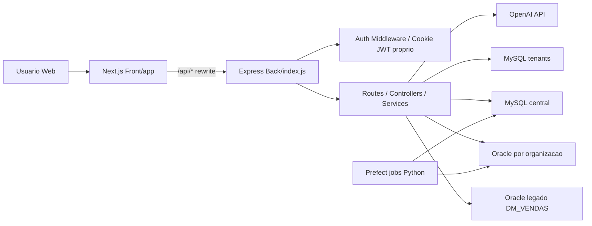

# Relatorio completo do projeto

Data da analise original: 2026-07-02  
Data da ultima atualizacao: 2026-08-10  
Escopo: leitura estatica do repositorio `GestaoMetas`, sem alteracao de codigo.  
Observacao: valores reais de `.env` nao foram expostos; foram coletados apenas nomes de variaveis.

Nota de atualizacao (2026-08-10): entre a analise original e esta atualizacao o repositorio recebeu ~30 commits (ver `git log`), incluindo varios itens que a versao anterior deste relatorio apontava como risco critico. Os principais avancos: `requireAuth` foi aplicado em `feed`, `desafios`, `ativacaoClientes`, `objetivoVendedor`, `areaAtaque`, `investigarCliente` e `alertasRanking`; os controllers passaram a derivar identidade (`usuario_id`, `empresa_id`, `role`) de `req.auth` em vez de body/query; foi adicionado rate limit no login (`express-rate-limit`); e foram criados tres modulos novos (filtro/liberacao de lojas para gerente, CRM Kanban do vendedor, Gerente de Sistemas) alem da migracao do modulo de feedback para MySQL central. Os riscos ainda abertos (build TS permissivo, ausencia de testes, senhas iniciais padrao) seguem descritos abaixo. As secoes foram atualizadas para refletir o estado atual; onde algo mudou desde a analise original, isso esta indicado explicitamente.

## 1. Resumo executivo

O projeto e uma plataforma web de inteligencia comercial chamada SIP / Gestao de Metas. Ela apoia gerentes, vendedores, administradores, superadministradores e industria/parceiros no acompanhamento de metas, ranking, carteira, campanhas, desafios, feed interno e consultas de cliente.

O problema principal resolvido e dar visibilidade operacional e gerencial sobre performance comercial: quem esta batendo meta, onde existe oportunidade, quais clientes devem ser atacados, quais campanhas estao rodando e como manter o time engajado.

Estagio aparente: **MVP/beta avancado, com hardening de seguranca em andamento**. Ha muitos modulos funcionais, Docker, autenticacao propria, multi-organizacao, Oracle/MySQL e UI extensa. Desde a analise original, a maior parte das rotas de negocio passou a exigir `requireAuth` e a derivar identidade/escopo do token (`req.auth`) em vez de aceitar `usuario_id`/`empresa_id`/`role` do cliente, e o login ganhou rate limit. Ainda nao e producao madura porque faltam testes automatizados, ha arquivos muito grandes e `ignoreBuildErrors: true` continua ativo no Next.

Principais pontos fortes:

| Ponto | Evidencia |
|---|---|
| Separacao clara entre frontend e backend | `Front/` com Next.js e `Back/` com Express |
| Dominio de negocio rico | rotas para ranking, vendedor, area de ataque, feed, desafios, ativacao, kanban, industria |
| Autenticacao com cookie HTTP-only | `Back/src/auth/token.js` |
| Escopo de negocio derivado do token, nunca do cliente | `Back/src/services/requestScope.js` (`getScopedEmpresaId`, `getScopedLojaScope`), usado por rotas/controllers de feed, desafios, ativacao, ranking, vendedor, kanban |
| Multi-tenant MySQL e Oracle por organizacao | `Back/src/db/mysql-tenants.js`, `Back/src/db/oracle-tenants.js` |
| Escopo multi-loja para gerentes, revalidado no servidor | `Back/src/services/lojaAcessoService.js`, `Back/src/services/gerenteLojasService.js` |
| Criptografia de segredos de organizacao | `Back/src/security/secrets.js` |
| Rate limit no login | `Back/src/routes/auth.js` (`express-rate-limit`, 10 tentativas/15min) |
| Docker para frontend/backend/MySQL | `docker-compose.yml`, `Front/Dockerfile`, `Back/Dockerfile` |

Maiores riscos tecnicos:

| Risco | Severidade | Evidencia |
|---|---:|---|
| Build TypeScript ignora erros | Alta | `Front/next.config.mjs` |
| Ausencia de suite de testes | Alta | `package.json` nao define `test`; apenas `Back/oracle:smoke` (`Back/test-oracle.js`) |
| Senhas iniciais padrao | Media/Alta | `Back/src/db/mysql-tenants.js`, `Back/src/routes/superadmin.js`, `Front/app/admin/page.tsx` |
| Papel `GERENTE_SISTEMAS` reescopa `empresa_id` por requisicao entre organizacoes | Media | `Back/src/middleware/auth.js`, `Back/src/services/gerenteSistemasService.js` — poder amplo, mitigado por allowlist e auditoria, mas vale confirmar que toda rota downstream respeita o reescopo |
| Kanban do vendedor sem checagem explicita de role/posse no nivel de rota | Media | `Back/src/routes/vendedorKanban.js` (so `requireAuth`; validacao de posse do `sk_vendedor` fica a cargo da camada de servico) |
| Arquivos grandes e acoplados | Media | `Front/app/vendedor/page.tsx`, `Back/src/services/desafios/desafiosService.js` |

Riscos da analise original ja resolvidos (ver nota de atualizacao):

| Risco (jul/2026) | Situacao (ago/2026) |
|---|---|
| Rotas de negocio sem autenticacao forte | `requireAuth` aplicado em feed, desafios, ativacao, objetivo vendedor, area de ataque, investigar cliente, alertas |
| Escopo de usuario aceito via query/body | Controllers agora usam `req.auth` (`getActorFromRequest` em `feedController.js` e equivalentes) |
| Sem rate limit no login | `loginRateLimiter` em `Back/src/routes/auth.js` |

Proximos passos mais importantes:

1. Remover `typescript.ignoreBuildErrors`.
2. Criar testes minimos de autenticacao/autorizacao e smoke tests de rotas criticas (incluindo posse de `sk_vendedor` no Kanban e reescopo do `GERENTE_SISTEMAS`).
3. Revisar senhas iniciais e fluxo de primeira troca obrigatoria.
4. Separar services e paginas grandes por casos de uso.
5. Confirmar que todas as rotas que recebem `empresa_id` reescopado pelo `GERENTE_SISTEMAS` validam o acesso corretamente.

## 2. Visao geral do projeto

Proposta do sistema: painel comercial para gestao de metas, ranking, oportunidades, ativacao de clientes, desafios/campanhas, feed interno e portal de industria.

Publico-alvo provavel:

| Perfil | Objetivo no sistema |
|---|---|
| `SUPERADMIN` | cadastrar organizacoes, credenciais Oracle, tenants MySQL e gerentes; ver feedbacks de usuarios |
| `ADMIN` | administrar organizacoes e usuarios em escopo administrativo |
| `GERENTE` | acompanhar time, ranking, desafios, feed, usuarios e ativacao; pode ter lojas extras liberadas alem do vinculo padrao |
| `GERENTE_SISTEMAS` | *(novo desde jul/2026)* papel de suporte/operacao sem vinculo fixo a uma organizacao; acessa organizacoes liberadas e "entra" como GERENTE ou VENDEDOR para troubleshooting |
| `VENDEDOR` | acompanhar propria meta, carteira, desafios, oportunidades, meta de vida e pipeline de clientes (Kanban) |
| `INDUSTRIA` | acompanhar desempenho de marca/campanha |

Principais funcionalidades encontradas:

- Login/logout e troca de senha (com rate limit).
- Dashboard do gerente, com Grand Prix (podio diario/mensal, comparativo com periodo anterior, download/compartilhamento via WhatsApp).
- Dashboard do vendedor.
- Ranking mensal e diario, com comparativo percentual vs. mes/ano anterior.
- Area de ataque por RFV.
- Investigacao de cliente por CPF/CNPJ/nome.
- Radar de vendas (secoes por equipe/clientes/categorias).
- Assistente de vendas com OpenAI.
- Central de ativacao de clientes com templates e WhatsApp.
- Feed interno com posts, curtidas, comentarios, destaque e mensagens privadas.
- Desafios/bonus/campanhas comerciais.
- Meta de vida e perfil do vendedor.
- CRM Kanban do vendedor: funil de clientes (a contatar/em contato/orcamento enviado/convertido) sincronizado automaticamente com orcamentos/pedidos, mais anotacoes manuais.
- Filtro/selecao de loja e liberacao de lojas extras para gerentes multi-loja.
- Gerente de Sistemas: acesso cross-organizacao para suporte.
- Envio de feedback pelo usuario (revisavel pelo SUPERADMIN).
- Administracao de instancias de WhatsApp (`whatsapp-admin`).
- Gestao de usuarios.
- Gestao de organizacoes e tenants.
- Portal da industria.
- Jobs Prefect para validacao de organizacoes.

Jornada principal:

1. Usuario acessa `/login`.
2. Backend autentica em MySQL central ou tenant (limitado por rate limit).
3. Front salva dados basicos em `sessionStorage`; backend seta cookie HTTP-only.
4. Usuario e redirecionado conforme role: `/admin`, `/admin/organizacoes`, `/dashboard`, `/vendedor`, `/industria` ou `/gerente-sistemas`.
5. Front consome `/api/*`; `Front/next.config.mjs` reescreve para o backend.
6. Backend consulta Oracle legado/global ou Oracle da organizacao, e MySQL central/tenant para auth e administracao; identidade e escopo de cada requisicao sao derivados de `req.auth` (token verificado), nao de parametros enviados pelo cliente.

## 3. Stack utilizada

| Tecnologia | Onde aparece | Funcao | Uso aparente | Riscos/inconsistencias |
|---|---|---|---|---|
| JavaScript/TypeScript | `Back/**/*.js`, `Front/**/*.tsx` | Linguagens principais | JS no backend, TS/TSX no frontend | Backend sem tipagem estatica |
| Next.js 16 | `Front/package.json`, `Front/app` | Frontend App Router | Bem usado para paginas e API route pontual | `ignoreBuildErrors: true` |
| React 19 | `Front/package.json` | UI | Uso amplo com hooks/componentes | Paginas muito grandes |
| Tailwind CSS 4 | `Front/package.json`, `Front/app/globals.css` | Estilo | UI customizada extensa | Paleta escura/verde muito dominante |
| Radix/shadcn | `Front/components/ui`, `components.json` | Componentes base | Biblioteca consistente | Alguns componentes de negocio ainda muito acoplados |
| Express 5 | `Back/package.json`, `Back/index.js` | API REST | Roteamento simples | Rotas sem middleware uniforme |
| Oracle `oracledb` | `Back/src/db/oracle*.js` | DW/operacional principal | Pool legado e conexoes por tenant | Forte dependencia externa; migrations Oracle manuais |
| MySQL `mysql2` | `Back/src/db/mysql*.js` | auth central/tenant | Multi-tenant e schema auto-criado | Credenciais e grants precisam hardening |
| bcrypt | `Back/src/routes/auth.js`, `superadmin.js` | Hash de senha | Uso correto para comparacao/hash | Minimo de senha baixo em alguns fluxos |
| Cookie parser | `Back/index.js` | Leitura de cookie auth | Integrado ao token proprio | A maioria das rotas de negocio ja usa `requireAuth` |
| express-rate-limit | `Back/src/routes/auth.js` | Rate limit do login | 10 tentativas/15min, `skipSuccessfulRequests` | Sem rate limit em outras rotas sensiveis (ex.: `/feedback`) |
| p-limit | `Back/package.json` (uso em sincronizacao/kanban) | Controle de concorrencia | Usado em jobs/sincronizacao em lote | - |
| OpenAI API via fetch | `Back/src/routes/assistenteVendas.js` | Assistente de vendas | Fallback sem chave | Sem cliente oficial; depende de env |
| ExcelJS | `Back/src/services/ativacaoClientesService.js` | Gerar planilhas | Usado na ativacao | Pode gerar arquivos grandes em memoria |
| html2canvas-pro | `Front/package.json`, `Front/components/dashboard/share-ranking-modal.tsx` | Captura de imagem do ranking | Gera imagem do Grand Prix para download/compartilhar via WhatsApp | Renderizacao client-side pode variar entre navegadores |
| Docker | `docker-compose.yml`, Dockerfiles | Deploy/local | Front, Back e MySQL | Compose depende de `Back/.env.docker` |
| Prefect/Python | `Back/jobs` | Jobs de diagnostico | Isolado | Sem integracao clara no compose |
| Testes | `Back/test-oracle.js` (`npm run oracle:smoke`) | Smoke Oracle | Pontual | Nao ha suite automatizada |

## 4. Estrutura de pastas

```text
GestaoMetas/
├─ Back/
│  ├─ index.js
│  ├─ src/
│  │  ├─ auth/
│  │  ├─ controllers/
│  │  ├─ db/
│  │  ├─ middleware/
│  │  ├─ routes/
│  │  ├─ security/
│  │  └─ services/
│  ├─ jobs/
│  ├─ scripts/
│  └─ sql/
├─ Front/
│  ├─ app/
│  ├─ components/
│  ├─ hooks/
│  ├─ lib/
│  ├─ public/
│  └─ styles/
├─ docker-compose.yml
└─ README.md
```

| Pasta | Responsabilidade | Principais arquivos | Clareza |
|---|---|---|---|
| `Back/src/routes` | Endpoints Express | `auth.js`, `rankingVendedores.js`, `superadmin.js`, `desafios.js`, `vendedorKanban.js`, `gerenteSistemas.js`, `lojaAcesso.js`, `feedback.js` | Clara; `requireAuth` agora aplicado na maior parte das rotas de negocio |
| `Back/src/controllers` | Adaptacao HTTP para services | `feedController.js`, `desafiosController.js`, `vendedorKanbanController.js`, `feedbackController.js` | Clara onde existe; identidade agora vem de `req.auth` na maioria dos controllers |
| `Back/src/services` | Regras de negocio e queries | `ativacaoClientesService.js`, `objetivoVendedorService.js`, `desafiosService.js`, `requestScope.js`, `lojaAcessoService.js`, `gerenteLojasService.js`, `gerenteSistemasService.js`, `kanban/*` | Forte, mas alguns services muito grandes |
| `Back/src/db` | Oracle/MySQL/conexao/tenants | `oracle.js`, `oracle-tenants.js`, `mysql-tenants.js` | Boa separacao; `mysql-tenants.js` agora tambem cria `gerente_lojas_liberadas` |
| `Back/sql` | DDL Oracle/MySQL | `ddl_gestao_metas.sql`, `crm_kanban.sql`, `mysql_schema_central.sql` | Util, mas sem migrations versionadas |
| `Back/jobs` | Prefect jobs | `prefect_flows.py`, `run_prefect.py` | Isolado e compreensivel |
| `Back/scripts` | Scripts utilitarios pontuais | `sincronizarKanbanTodosVendedores.js` (backfill/cron do Kanban) | Isolado; nao integrado ao compose/scheduler |
| `Front/app` | Rotas App Router | `dashboard/page.tsx`, `vendedor/page.tsx`, `admin/page.tsx`, `vendedor/kanban/page.tsx`, `gerente-sistemas/page.tsx` | Rotas claras, arquivos grandes |
| `Front/components` | UI e modulos | `dashboard`, `feed`, `challenges`, `ativacao-clientes` | Boa organizacao por dominio |
| `Front/hooks` | Estado/consumo API | `useFeed.ts`, `useChallenges.ts` | Boa ideia; escopo de loja agora e revalidado no backend, nao apenas confiado do cliente |
| `Front/lib` | Tipos e clientes | `user-session.ts`, `challenges.ts`, `activation-service.ts`, `status.ts` | Centraliza utilitarios |

## 5. Arquitetura geral

Tipo de arquitetura: **monorepo informal frontend/backend**, com frontend Next.js consumindo API Express via rewrite `/api/*`.

Separacao:

- Frontend: Next.js App Router, paginas client-side, componentes e hooks.
- Backend: Express REST, controllers/services/routes.
- Banco principal de negocio: Oracle.
- Banco de autenticacao/tenants: MySQL.
- Jobs: Python/Prefect para diagnostico.
- Integracoes externas: OpenAI API, WhatsApp links, Oracle Instant Client, Vercel Analytics, avatar externo `ui-avatars.com`.

Fluxo de dados:

1. Browser chama `Front/app/*`.
2. Pagina/hook chama `/api/...`.
3. `next.config.mjs` reescreve para `http://localhost:3001/api/...` ou `NEXT_PUBLIC_API_URL`.
4. Express aplica middlewares globais (`cors`, JSON, cookies).
5. Algumas rotas aplicam `requireAuth`; outras nao.
6. Services consultam Oracle legado/global, Oracle por tenant ou MySQL.
7. Resposta volta para o frontend e atualiza estado client-side.

Diagrama Mermaid:


```mermaid
flowchart LR
  U[Usuario Web] --> F[Next.js Front/app]
  F -->|/api/* rewrite| B[Express Back/index.js]
  B --> A[Auth Middleware / Cookie JWT proprio]
  B --> S[Routes / Controllers / Services]
  S --> O1[Oracle legado DM_VENDAS]
  S --> O2[Oracle por organizacao]
  S --> M1[MySQL central]
  S --> M2[MySQL tenants]
  S --> AI[OpenAI API]
  J[Prefect jobs Python] --> M1
  J --> O2
```

Pontos de acoplamento/gargalos:

- Front depende de `sessionStorage` para role, nome, empresa e vendedor.
- Backend tem varias rotas acopladas diretamente a tabelas/views `DM_VENDAS`.
- `queryOracleByEmpresaId` abre conexao por chamada, diferente do pool legado.
- Services grandes misturam validacao, SQL, normalizacao e regra.
- Sem cache aparente para consultas pesadas de dashboard/ranking.

## 6. Fluxo de execucao

Aplicacao inicia assim:

- Backend: `Back/index.js` importa dotenv, Oracle Client, cria Express, registra rotas e chama `ensureCentralSchema()` antes de `app.listen`.
- Frontend: `Front/app/layout.tsx` configura fontes, providers de notificacao e analytics; paginas em `Front/app`.
- Docker: `docker-compose.yml` sobe `frontend`, `backend` e `mysql`.

Fluxo de requisicao:

1. Browser chama `/api/rota`.
2. Next rewrite manda para backend.
3. Express processa JSON ate `8mb`, cookies e CORS.
4. Rota decide se exige `requireAuth`.
5. Service executa query Oracle/MySQL.

Fluxo de autenticacao:

1. `POST /api/login` em `Back/src/routes/auth.js`.
2. Busca usuario em `usuarios_auth` central.
3. Se nao achar, busca em tenants ativos.
4. Compara `senha` com `bcrypt.compare`.
5. Emite token proprio formato JWT HS256 em `Back/src/auth/token.js`.
6. Seta cookie HTTP-only `sip_auth` por padrao.
7. Front salva payload publico em `sessionStorage` via `Front/lib/user-session.ts`.
8. `requireAuth` valida cookie/bearer e reconsulta usuario/token_version.

Fluxo de banco:

- Oracle legado: `Back/src/db/oracle.js` cria pool com `DB_USER`, `DB_PASSWORD`, `DB_CONNECT_STRING`.
- Oracle tenant: `Back/src/db/oracle-tenants.js` busca credenciais em `organizacoes_auth`, decripta e conecta.
- MySQL central: `Back/src/db/mysql.js`.
- MySQL tenants: `Back/src/db/mysql-tenants.js` cria database `org_<id>_<slug>` e tabela `usuarios_auth`.

Onde ficam regras de negocio:

- Ranking/vendedor/area/radar: parte em routes.
- Feed, desafios, ativacao, objetivo, kanban: majoritariamente em services.
- Escopo (empresa/loja) centralizado em `Back/src/services/requestScope.js` e `lojaAcessoService.js`, consumido por routes/controllers/services.
- Auth/usuarios/superadmin: routes e services de auth.

## 7. Funcionalidades implementadas

| Funcionalidade | Objetivo | Arquivos | Status aparente | Riscos/melhorias |
|---|---|---|---|---|
| Login/logout | Autenticar usuarios | `Back/src/routes/auth.js`, `Back/src/auth/token.js`, `Front/app/login/page.tsx` | Completo | Rate limit ja aplicado; falta auditoria de tentativas |
| Troca de senha | Usuario troca senha | `auth.js`, `usuarios.js`, `Front/app/perfil/page.tsx` | Parcial | Dois endpoints parecidos; padronizar |
| Superadmin organizacoes | Cadastrar org, Oracle, tenant | `Back/src/routes/superadmin.js`, `Back/src/db/mysql-tenants.js` | Completo/frágil | Senhas padrao, operacoes destrutivas, logs |
| Admin organizacoes | CRUD via controller | `Back/src/routes/organizacoes.js`, `organizacoesService.js` | Parcial | Duas abordagens paralelas a superadmin |
| Ranking | Ranking mensal/diario, comparativo com periodo anterior, Grand Prix com download/compartilhamento | `rankingVendedores.js`, `Front/app/dashboard/page.tsx`, `share-ranking-modal.tsx` | Completo | Depende de views Oracle |
| Dashboard vendedor | Metas, oportunidades | `vendedor.js`, `Front/app/vendedor/page.tsx` | Completo | Pagina grande; escopo agora revalidado no backend (`requestScope.js`) |
| Area de ataque | Priorizar carteira RFV | `areaAtaque.js`, `Front/app/area-ataque/page.tsx` | Completo | `requireAuth` aplicado; agrega todas as lojas do usuario por padrao |
| Investigar cliente | Busca cliente detalhada | `investigarCliente.js`, `Front/app/investigar-cliente/page.tsx` | Completo | `requireAuth` aplicado |
| Radar vendas | Tendencias, agora organizadas por secao (equipe/clientes/categorias) | `radarVendas.js`, `RadarVendas.tsx` | Completo | Protegido por auth, mas consultas pesadas |
| Assistente vendas | Sugestoes via regras/OpenAI | `assistenteVendas.js` | Parcial | OpenAI direto; tratar custos/limites |
| Ativacao clientes | Segmentos, preview, Excel/WhatsApp | `ativacaoClientes*`, `Front/app/ativacao-clientes/page.tsx` | Completo | `requireAuth` aplicado; identidade via `req.auth` |
| Feed | Posts/curtidas/comentarios | `feed*`, `Front/app/feed/page.tsx` | Completo | `requireAuth` aplicado; identidade via `req.auth` (`getActorFromRequest`) |
| Desafios | Campanhas/desafios/bonus | `desafios*`, `Front/app/desafios/page.tsx` | Completo | `requireAuth` aplicado |
| Meta de vida | Objetivos pessoais do vendedor | `objetivoVendedor*`, `LifeGoalWizard.tsx` | Completo | `requireAuth` aplicado |
| CRM Kanban do vendedor | Funil de clientes por vendedor, sincronizado de orcamentos/pedidos + anotacoes manuais | `Back/src/routes/vendedorKanban.js`, `Back/src/services/kanban/*`, `Front/app/vendedor/kanban/page.tsx` | Completo/novo | Sem `requireRole`/checagem explicita de posse do `sk_vendedor` na rota; sincronizacao so dispara ao abrir a tela (mitigado por `scripts/sincronizarKanbanTodosVendedores.js`) |
| Lojas liberadas para gerente / filtro de loja | Permite gerente multi-loja acessar lojas alem do vinculo padrao, com selecao explicita nas telas de Ranking/Painel do Vendedor | `Back/src/services/lojaAcessoService.js`, `gerenteLojasService.js`, `requestScope.js`, `Front/app/admin/page.tsx` | Completo/novo | Escopo sempre revalidado contra Oracle/MySQL no servidor; liberacao manual so existe no MySQL de tenant, nao no central |
| Gerente de Sistemas | Suporte cross-organizacao: entra como GERENTE/VENDEDOR em orgs liberadas | `Back/src/routes/gerenteSistemas.js`, `gerenteSistemasService.js`, `Front/app/gerente-sistemas/page.tsx` | Completo/novo | Papel reescopa `empresa_id` por requisicao; acesso auditado, mas poder amplo |
| Feedback de usuario | Usuario envia feedback livre; SUPERADMIN revisa | `Back/src/routes/feedback.js`, `feedbackController.js` | Completo/novo | Sem rate limit; texto limitado a 2000 chars |
| Admin de WhatsApp | Gerenciar instancias de WhatsApp por vendedor (status/QR code) | `Back/src/routes/whatsappAdmin.js`, `whatsappAdminController.js` | Completo | `requireRole("GERENTE","ADMIN","SUPERADMIN")` |
| Industria | Login e dashboard por marca | `industria.js`, `Front/app/industria/page.tsx` | Completo | Nao usa `requireAuth`, mas valida token/role `INDUSTRIA` manualmente (`getIndustryClaims`); marca vem do token, nao do cliente |
| Upload foto | Avatar usuario | `usuarios.js`, `Front/app/perfil/page.tsx` | Parcial | Valida MIME/tamanho, mas nao assinatura real |
| Jobs diagnostico | Validar orgs/views | `Back/jobs` | Parcial | Nao integrado ao deploy principal |

## 8. Rotas, telas e navegacao

### Telas frontend

| Rota | Finalidade | Componentes/dados | Problemas possiveis |
|---|---|---|---|
| `/` | Landing page | `Front/app/page.tsx`, ranking via hook | Chama ranking que exige auth; pode falhar em publico |
| `/como-funciona` | Pagina explicativa | `Front/app/como-funciona/page.tsx` | Arquivo grande |
| `/login` | Login | `/api/login` | Lembrar de mim nao implementado de fato |
| `/alterar-senha` | Troca senha temporaria | `/api/alterar-senha` | Depende de cookie ja setado |
| `/dashboard` | Gerente | `/api/ranking-vendedores`, radar, alertas | Checagem de role so client-side antes das APIs |
| `/vendedor` | Vendedor | `/api/vendedor/:id`, oportunidades, desafios | Arquivo muito grande |
| `/vendedor/kanban` | Pipeline de clientes do vendedor | `/api/vendedor/:sk/kanban*` | Novo desde jul/2026; sem checagem explicita de posse na rota |
| `/area-ataque` | Carteira priorizada | `/api/area-ataque/:id`, assistente | Backend protegido por `requireAuth` |
| `/investigar-cliente` | Busca cliente | `/api/investigar-cliente` | Backend protegido por `requireAuth` |
| `/ativacao-clientes` | Campanhas WhatsApp | `/api/ativacao-clientes/*` | Backend protegido por `requireAuth` |
| `/feed` | Feed interno | `/api/feed/*` | Backend protegido; identidade via `req.auth` |
| `/desafios` | Gerente cria desafios | `/api/desafios/*` | Backend protegido por `requireAuth` |
| `/vendedor/desafios` | Vendedor ve desafios | `/api/vendedor/:sk/desafios` | Backend protegido por `requireAuth` |
| `/vendedor/minha-meta-de-vida` | Meta pessoal | `/api/objetivo-vendedor/*` | Backend protegido por `requireAuth` |
| `/perfil` | Perfil/foto/senha | `/api/usuarios/*` | Protegido |
| `/usuarios` | Gestao de usuarios | `/api/usuarios/gerenciamento` | Protegido por auth |
| `/admin` | Superadmin, inclui gestao de lojas liberadas de gerentes | `/api/superadmin/*`, `/api/superadmin/gerentes/:id/lojas` | Backend protegido por role |
| `/admin/organizacoes` | Admin orgs | `/api/organizacoes/*` | Backend protegido por ADMIN/SUPERADMIN |
| `/gerente-sistemas` | Suporte cross-org: entrar como GERENTE/VENDEDOR de outra organizacao | `/api/gerente-sistemas/*` | Novo desde jul/2026; `requireRole("GERENTE_SISTEMAS")`, acesso auditado |
| `/industria` | Portal industria | `/api/login-industria`, `/api/industria/dashboard` | Validacao propria de token/role no dashboard |

### Endpoints backend

| Grupo | Rotas principais | Protecao aparente |
|---|---|---|
| Auth | `/login` (com rate limit), `/logout`, `/alterar-senha`, `/resetar-senhas-temporarias` | Parcial; reset protegido |
| Superadmin | `/superadmin/*` | `router.use(requireAuth)` + role manual |
| Organizacoes | `/organizacoes/*` | `requireAuth` + `requireRole("ADMIN","SUPERADMIN")` |
| Usuarios | `/usuarios/perfil`, `/usuarios/gerenciamento`, upload, senha | Protegido, exceto foto publica e CPF bloqueado |
| Ranking | `/ranking-vendedores`, `/ranking-vendedores/comparativo` | `requireAuth` |
| Vendedor | `/vendedor/:sk`, `/vendedor-panorama/:sk`, oportunidades | `requireAuth` |
| Radar | `/radar-vendas` | `requireAuth` |
| Assistente | `/assistente-vendas` | `requireAuth` |
| Area ataque | `/area-ataque/:vendedor_id` | `requireAuth` |
| Alertas | `/alertas-ranking` | `requireAuth` |
| Investigar cliente | `/investigar-cliente` | `requireAuth` |
| Feed | `/feed/*` | `requireAuth`; identidade via `req.auth` |
| Desafios | `/desafios/*`, `/vendedor/:sk/desafios*` | `requireAuth` |
| Ativacao | `/ativacao-clientes/*`, `/templates-mensagens*` | `requireAuth` |
| Objetivo/perfil vendedor | `/objetivo-vendedor*`, `/perfil-vendedor*` | `requireAuth` |
| Kanban | `/vendedor/:sk/kanban*`, `/vendedor/:sk/clientes/busca` | `requireAuth` (sem `requireRole`/checagem explicita de posse do `sk_vendedor` na rota) |
| Loja/acesso | `/minhas-lojas` | `requireAuth` |
| Gerente de Sistemas | `/gerente-sistemas/*` | `requireAuth` + `requireRole("GERENTE_SISTEMAS")`, com auditoria |
| Feedback | `POST /feedback` (`requireAuth`), `GET /superadmin/feedbacks` (`requireRole("SUPERADMIN")`) | Protegido; sem rate limit no envio |
| WhatsApp admin | `/whatsapp-admin/*` | `requireAuth` + `requireRole("GERENTE","ADMIN","SUPERADMIN")` |
| Industria | `/login-industria`, `/industria/dashboard` | Login proprio; dashboard valida token/role via `getIndustryClaims` (nao usa `requireAuth`, mas nao aceita marca do cliente) |

## 9. APIs, controllers, services e handlers

| Item | Arquivo | Entrada | Saida | Validacoes/tratamento | Riscos |
|---|---|---|---|---|---|
| Auth token | `Back/src/auth/token.js` | usuario | token/cookie | exp, role, assinatura, secret min 32 | Implementacao propria; sem lib JWT madura |
| `requireAuth` | `Back/src/middleware/auth.js` | cookie/bearer | `req.auth` | reconsulta usuario e token_version; reescopa `empresa_id` para `GERENTE_SISTEMAS` | Aplicado na maior parte das rotas de negocio |
| Login | `Back/src/routes/auth.js` | login/senha | user publico + cookie | bcrypt, ativo, rate limit (10/15min) | - |
| Escopo de requisicao | `Back/src/services/requestScope.js` | `req.auth`, `empresa_id`/`empresa_acesso` opcionais | `{applies, lojaIds, error}` | Nunca confia em `empresa_acesso` do cliente; sempre revalida contra `FATO_FUNCIONARIOS_ACESSOS`/`gerente_lojas_liberadas` | Ponto central; bug aqui afeta todas as rotas que o usam |
| Kanban | `Back/src/routes/vendedorKanban.js`, `vendedorKanbanController.js`, `services/kanban/*` | `sk_vendedor`, cartao/interacao | board/cartoes | `requireAuth` apenas | Confirmar que vendedor so acessa o proprio `sk_vendedor` |
| Gerente de Sistemas | `Back/src/routes/gerenteSistemas.js`, `gerenteSistemasService.js` | `empresa_id` alvo | orgs/vendedores/entrada | `requireRole("GERENTE_SISTEMAS")`, allowlist por org, `auditAction` no `/entrar` | Reescopo de `empresa_id` por requisicao concentra poder |
| Feedback | `Back/src/routes/feedback.js`, `feedbackController.js` | texto livre (max 2000) | registro em MySQL central | `requireAuth`/`requireRole("SUPERADMIN")` para leitura | Sem rate limit no envio |
| Superadmin | `Back/src/routes/superadmin.js` | CRUD orgs/gerentes | JSON | role `SUPERADMIN` | Arquivo grande; senha vendedor padrao |
| Ranking | `Back/src/routes/rankingVendedores.js` | modo, empresa_id | ranking | auth e escopo | Query sem paginacao |
| Vendedor | `Back/src/routes/vendedor.js` | sk_vendedor | painel/oportunidades | auth | Verificar se vendedor nao acessa outro sk |
| Feed | `Back/src/controllers/feedController.js`, `feedService.js` | payload de post/comentario | posts/comentarios | identidade via `getActorFromRequest(req)` (`req.auth`) | - |
| Ativacao | `ativacaoClientesController.js`, service | payload de segmento/campanha | segmentos, preview, Excel | identidade/escopo via `req.auth` + `requestScope.js` | - |
| Desafios | `desafiosController.js`, service | payload desafio/sk | desafios/progresso | `requireAuth`; identidade via `req.auth` | - |
| Meta de vida | `objetivoVendedorController.js`, service | vendedor_id/payload | objetivo/perfil | `requireAuth` | - |
| Industria | `Back/src/routes/industria.js` | codigo/senha ou marca | sessao industria/dashboard | bcrypt no login; dashboard valida token/role `INDUSTRIA` via `getIndustryClaims` | Nao usa o middleware `requireAuth` padrao (validacao propria equivalente) |
| Jobs Prefect | `Back/jobs/*.py` | CLI/env | diagnosticos | retries Prefect | Depende de env e MySQL |

## 10. Banco de dados e persistencia

Banco utilizado:

- Oracle: principal fonte de dados comerciais e parte das tabelas de produto.
- MySQL: autenticacao central, organizacoes, tenants e diagnosticos.

Configuracao:

- Oracle legado: `DB_USER`, `DB_PASSWORD`, `DB_CONNECT_STRING`.
- Oracle por organizacao: `organizacoes_auth.oracle_*` criptografado por `APP_ENCRYPTION_KEY`.
- MySQL: `MYSQL_*` ou fallback `DB_*`.

Migrations:

- Existem DDLs em `Back/sql`, mas nao ha framework de migration versionado.
- `ensureCentralSchema()` cria/ajusta parte do MySQL automaticamente.

Entidades principais:

| Entidade | Banco | Finalidade | Campos principais | Relacionamentos | Riscos/melhoria |
|---|---|---|---|---|---|
| `usuarios_auth` | MySQL central/tenant | Auth usuarios | login, senha_hash, role (agora inclui `GERENTE_SISTEMAS`), empresa_id, sk_vendedor, token_version | organizacao/tenant | Padronizar migration, senha inicial |
| `organizacoes_auth` | MySQL central | Empresas/tenants | nome, codigo, oracle_user, oracle_password, db_name | tenants MySQL/Oracle | Credenciais criptografadas; hardening de grants |
| `organizacoes_diagnosticos` | MySQL | Jobs de validacao | status, payload_json | organizacao | OK; limitar payload sensivel |
| `gerente_lojas_liberadas` *(novo)* | MySQL tenant | Lojas extras liberadas para um gerente alem do vinculo padrao | id_acesso, id_usuario, empresa_acesso, nome_resumido, criado_em | `usuarios_auth` (tenant) | So existe no MySQL de tenant, nao no central; DDL inline em `mysql-tenants.js`, nao em `Back/sql` |
| `gerente_sistema_organizacoes` *(novo)* | MySQL central | Organizacoes liberadas para um `GERENTE_SISTEMAS` | id_acesso, id_usuario, empresa_id, ativo | `usuarios_auth` central, `organizacoes_auth` | Allowlist de acesso cross-tenant; concentra poder se mal configurada |
| `feedback_usuarios` *(novo)* | MySQL central | Feedback enviado por usuarios | id_feedback, id_usuario, empresa_id, sk_vendedor, tipo_usuario, feedback (texto), criado_em | usuarios (por id/empresa) | Sem rate limit no envio |
| `FEED_POSTS` | Oracle | Feed | usuario_id, mensagem, visibilidade | comentarios/curtidas | - |
| `FEED_COMENTARIOS` | Oracle | Comentarios | post_id, usuario_id, comentario | feed_posts | OK estrutural |
| `FEED_CURTIDAS` | Oracle | Curtidas | post_id, usuario_id | feed_posts | OK estrutural |
| `DESAFIOS_COMERCIAIS` | Oracle | Desafios/campanhas | titulo, status, periodo, aceite | metas/vendedores/progresso | - |
| `DESAFIOS_COMERCIAIS_METAS` | Oracle | Metas de desafio | tipo_meta, meta_valor, config_json | desafio | Validar JSON |
| `DESAFIOS_COMERCIAIS_VENDEDORES` | Oracle | Participantes | id_desafio, sk_vendedor, status | desafio | Controle de acesso por sk |
| `OBJETIVOS_VENDEDOR` | Oracle | Meta de vida | sk_vendedor, valor, data_limite | vendedor | - |
| `PERFIL_VENDEDOR` | Oracle | Perfil pessoal | renda, preferencias, salario | vendedor | Dados pessoais |
| `CAMPANHAS_ATIVACAO` | Oracle | Campanhas | segmento, mensagem, usuario | clientes/eventos/links | - |
| `CRM_KANBAN_CARD` *(novo)* | Oracle | Cartao do funil de vendas por cliente/vendedor | id, empresa_id, sk_vendedor, sk_cliente, coluna_atual, origem_status, ordem, arquivado | interacoes, cliente, vendedor | Unico por vendedor+cliente; `Back/sql/crm_kanban.sql` |
| `CRM_KANBAN_INTERACAO` *(novo)* | Oracle | Historico de interacoes/mudancas de coluna do cartao | id, card_id, tipo, conteudo, coluna_origem/destino, autor, data | `CRM_KANBAN_CARD` | - |
| `GM_TB_FORNECEDORES_LOGIN` | Oracle | Login/marca da industria | id, codigo, senha_hash, marca, ativo | dashboard industria | - |
| Views ranking/RFV | Oracle | Dados analiticos | vendas/meta/ranking | fatos/dimensoes | Dependencia forte de DW |

Dados sensiveis:

- Credenciais Oracle em `.env` e `organizacoes_auth`.
- Hashes de senha em MySQL/Oracle.
- CPF/CNPJ de usuarios/clientes.
- Dados comerciais e faturamento.
- Possiveis mensagens privadas do feed.

## 11. Autenticacao e autorizacao

Como login funciona: `POST /api/login` busca usuarios no MySQL central ou tenants, compara bcrypt, gera token assinado e seta cookie HTTP-only; limitado a 10 tentativas/15min por `express-rate-limit`.

Sessao/token: token proprio HS256 com `exp`, `role`, `empresa_id`, `sk_vendedor` e `token_version`. Cookie usa `httpOnly`, `sameSite` configuravel e `secure` em producao.

Usuario identificado: em rotas protegidas, `req.auth` (repopulado a cada requisicao com reconsulta do usuario e `token_version`). Escopo de negocio (empresa/loja) e resolvido a partir de `req.auth` por `Back/src/services/requestScope.js`, que nunca confia em `empresa_id`/`empresa_acesso` vindos de query/body — sempre revalida contra `FATO_FUNCIONARIOS_ACESSOS` (Oracle) ou `gerente_lojas_liberadas` (MySQL tenant). Identidade de ator (quem criou um post, comentario, etc.) tambem vem de `req.auth` nos controllers (`getActorFromRequest`), nao mais de parametros do cliente.

Papel especial `GERENTE_SISTEMAS`: unico caso em que `req.auth.empresa_id` pode ser reescopado por requisicao (via `assertSystemManagerOrganizationAccess` em `Back/src/middleware/auth.js`), permitindo a um usuario de suporte atuar em qualquer organizacao da sua allowlist (`gerente_sistema_organizacoes`). O acesso e auditado no `/gerente-sistemas/entrar`, mas a auditoria so vai para `console.log` (`Back/src/audit.js`), sem persistencia.

Rotas protegidas por `requireAuth`: praticamente todas as rotas de negocio — auth sensivel, superadmin, organizacoes, usuarios, ranking, vendedor, radar, assistente, feed, desafios, ativacao, objetivo/perfil vendedor, investigar cliente, area de ataque, alertas, kanban, loja-acesso, gerente-sistemas, feedback, whatsapp-admin.

Excecao conhecida: `Back/src/routes/industria.js` nao usa o middleware `requireAuth` — faz validacao propria de token/role `INDUSTRIA` (`getIndustryClaims`) e resolve a `marca` a partir do token, nao do cliente. Funcionalmente equivalente, mas fora do padrao comum, o que dificulta auditar a cobertura de auth so por `grep requireAuth`.

Classificacao de seguranca desta parte: **media** (evoluiu de "baixa" na analise original).

Justificativa tecnica: a maior lacuna identificada em jul/2026 — rotas de negocio sem auth e identidade aceita do cliente — foi corrigida na maior parte do codigo. O que resta: (1) o Kanban do vendedor tem `requireAuth` mas nenhuma checagem explicita de posse do `sk_vendedor` visivel na rota; (2) o papel `GERENTE_SISTEMAS` concentra poder cross-tenant por design, e vale confirmar que toda rota downstream (nao so o middleware) respeita o `empresa_id` reescopado; (3) a rota de industria foge do padrao `requireAuth`, o que exige atencao extra em revisoes futuras; (4) nao ha rate limit fora do login (ex.: `/feedback`, buscas de cliente).

Melhorias recomendadas (atualizado):

1. Adicionar checagem explicita de posse do `sk_vendedor` nas rotas de Kanban.
2. Auditar (com testes) se todas as rotas acessadas por `GERENTE_SISTEMAS` respeitam o `empresa_id` reescopado.
3. Persistir a trilha de auditoria (`Back/src/audit.js`) em vez de apenas `console.log`.
4. Padronizar `industria.js` para usar `requireAuth`/`requireRole` como as demais rotas, mesmo que a logica atual ja seja segura.
5. Adicionar rate limit em outras rotas sensiveis (feedback, busca de cliente).

## 12. Variaveis de ambiente

| Variavel | Finalidade provavel | Camada | Obrigatoria | Risco se ausente | Risco se exposta | Ambiente |
|---|---|---|---|---|---|---|
| `PORT` | porta backend | Back | opcional | usa 3001 | baixo | local/prod |
| `NODE_ENV` | ambiente | Back/Docker | opcional | cookies podem nao ser secure | baixo | todos |
| `CORS_ORIGINS` | origens permitidas | Back | recomendada | fallback localhost | medio | todos |
| `AUTH_TOKEN_SECRET` | assinar token | Back | sim | backend falha | critico | todos |
| `AUTH_TOKEN_TTL_SECONDS` | TTL token | Back | opcional | usa 12h | medio | todos |
| `AUTH_COOKIE_NAME` | nome cookie | Back | opcional | usa `sip_auth` | baixo | todos |
| `AUTH_COOKIE_SAME_SITE` | SameSite | Back | opcional | usa lax | medio | prod |
| `APP_ENCRYPTION_KEY` | AES-GCM segredos | Back/jobs | sim | backend falha | critico | todos |
| `ORGANIZACOES_ENCRYPT_SECRET` | criptografia antiga em `organizacoesService.js` | Back | duvida | modulo pode falhar | critico | legado |
| `DB_USER` | Oracle legado ou fallback MySQL | Back | sim p/Oracle | sem Oracle legado | alto | todos |
| `DB_PASSWORD` | senha Oracle/fallback | Back | sim p/Oracle | sem Oracle legado | critico | todos |
| `DB_CONNECT_STRING` | DSN Oracle legado | Back | sim p/Oracle | sem Oracle legado | alto | todos |
| `DB_HOST`/`DB_PORT`/`DB_NAME` | fallback MySQL | Back | opcional | fallback incompleto | medio | local |
| `MYSQL_HOST` | host MySQL | Back/jobs | sim p/MySQL | auth indisponivel | alto | todos |
| `MYSQL_PORT` | porta MySQL | Back/jobs | opcional | usa 3306 | baixo | todos |
| `MYSQL_DATABASE` | banco central | Back/jobs | sim | auth central falha | medio | todos |
| `MYSQL_USER` | usuario MySQL app | Back/jobs | sim | auth falha | alto | todos |
| `MYSQL_PASSWORD` | senha MySQL app | Back/jobs | sim | auth falha | critico | todos |
| `MYSQL_ROOT_PASSWORD` | root Docker | Docker | sim p/compose | MySQL nao sobe | critico | local/prod |
| `MYSQL_ADMIN_HOST`/`PORT`/`USER`/`PASSWORD` | admin tenant | Back | sim p/provisionar | cria tenant falha | critico | admin/prod |
| `MYSQL_GRANT_USER` | usuario de grants | Back | opcional | grants padrao | alto | prod |
| `MYSQL_USER_HOST` | host permitido | Back | importante prod | `%` bloqueado em prod | alto | prod |
| `MYSQL_TENANT_GRANT_PRIVILEGES` | privilegios tenant | Back | opcional | usa SELECT/INSERT/UPDATE/DELETE | medio | prod |
| `MYSQL_CONNECT_TIMEOUT_MS` | timeout MySQL | Back | opcional | usa 5000 | baixo | todos |
| `SUPERADMIN_INITIAL_LOGIN` | seed superadmin | Back | recomendado | usa `admin` | alto | bootstrap |
| `SUPERADMIN_INITIAL_PASSWORD` | seed superadmin | Back | recomendado | usa senha padrao | critico | bootstrap |
| `ALLOW_DESTRUCTIVE_ORG_DELETE` | drop tenant delete | Back | opcional | preserva DB | alto se true | admin |
| `ENABLE_ORACLE_LOGIN_FALLBACK` | encontrado no env | Back | duvida | nao vi uso direto | duvida | legado |
| `ORACLE_CLIENT_MODE` | thin/thick | Back | opcional | auto/thin | medio | todos |
| `ORACLE_REQUIRE_THICK` | exigir thick | Back | opcional | thin permitido | medio | prod |
| `ORACLE_CLIENT_LIB_DIR` | Instant Client local | Back | opcional | thick pode falhar | medio | local |
| `ORACLE_TENANT_PASSWORD_FALLBACK` | fallback decriptacao | Back | opcional | tenant pode falhar | critico se exposta | migracao |
| `OPENAI_API_KEY` | assistente | Back | opcional | fallback sem IA | critico | todos |
| `OPENAI_MODEL` | modelo OpenAI | Back | opcional | usa `gpt-4.1` | baixo | todos |
| `N8N_ATIVACAO_WEBHOOK` | envio campanha | Back | opcional | sem webhook | alto se exposta | prod |
| `PREFECT_VALIDATION_INTERVAL_SECONDS` | intervalo jobs | Jobs | opcional | usa 1800 | baixo | jobs |
| `NEXT_PUBLIC_API_URL` | destino API/rewrite | Front | recomendada | localhost | medio | build/prod |
| `NEXT_PUBLIC_BACKEND_PORT` | porta backend | Front | opcional | usa 3001 | baixo | local |
| `BACKEND_PORT` | porta backend compose | Docker/Front | opcional | usa 3001 | baixo | local/prod |

## 13. Seguranca

| Risco | Severidade | Evidencia no codigo | Impacto | Correcao recomendada | Prioridade |
|---|---|---|---|---|---|
| Senhas iniciais padrao | Alta | `admin123`, `sip123` em codigo/UI | Acesso previsivel se nao alterado | Gerar senha unica, forcar troca | P1 |
| `ignoreBuildErrors: true` | Alta | `Front/next.config.mjs` | Deploy com erros de tipo | Remover e corrigir TS | P1 |
| Kanban sem checagem explicita de posse do `sk_vendedor` na rota | Media | `Back/src/routes/vendedorKanban.js` (so `requireAuth`) | Vendedor poderia tentar acessar `sk_vendedor` de outro se a validacao de service falhar | Adicionar checagem explicita na rota, nao so na camada de service | P1 |
| `GERENTE_SISTEMAS` reescopa `empresa_id` por requisicao | Media | `Back/src/middleware/auth.js`, `gerenteSistemasService.js` | Papel de suporte com acesso cross-tenant; erro de allowlist expoe outra organizacao | Testes de autorizacao dedicados; revisar periodicamente `gerente_sistema_organizacoes` | P1 |
| Auditoria nao persistida | Media | `Back/src/audit.js` so faz `console.log`, inclusive para `GERENTE_SISTEMAS` entrando em outra org | Sem trilha investigavel depois que os logs rotacionam | Persistir auditoria (tabela dedicada) | P1 |
| Rota de industria fora do padrao `requireAuth` | Baixa/Media | `Back/src/routes/industria.js` (validacao propria via `getIndustryClaims`) | Nao e uma falha hoje (marca vem do token), mas dificulta auditoria de cobertura de auth | Padronizar para `requireAuth`/`requireRole` | P2 |
| Sem rate limit fora do login | Media | `Back/src/routes/feedback.js`, buscas de cliente | Spam/abuso em endpoints autenticados | Rate limit adicional | P2 |
| Upload valida MIME declarado, nao assinatura | Media | `Back/src/routes/usuarios.js` | Arquivo malformado salvo | Validar magic bytes/processar imagem | P2 |
| Logs com detalhes tecnicos | Media | varios `console.error/warn/log` | Exposicao de detalhes em prod | Logger estruturado e redacao | P2 |
| CORS configuravel mas simples | Media | `Back/index.js` | Misconfig em prod | Validar origins e evitar wildcard | P2 |
| Sem CSP/security headers | Media | nao observado helmet | XSS/clickjacking | Adicionar Helmet/CSP | P2 |

Riscos criticos da analise original (jul/2026) hoje mitigados — ver secao 11: rotas sem `requireAuth` em modulos de negocio, identidade/escopo aceitos do cliente, e ausencia de rate limit no login.

## 14. Qualidade de codigo

Pontos fortes:

- Estrutura por dominios no frontend (`components/feed`, `components/challenges`, etc.).
- Services dedicados para modulos complexos.
- Parametrizacao de queries em muitos pontos.
- Revalidacao de `token_version` para invalidar sessoes.
- `resolveOracleObjectNames` ajuda compatibilidade com nomes legados.

Pontos frageis:

- Arquivos grandes demais: `Front/app/vendedor/page.tsx` (~74 KB), `Front/app/industria/page.tsx` (~54 KB), `objetivoVendedorService.js` (~49 KB), `desafiosService.js` (~49 KB).
- Mistura de regra de negocio e HTTP em varias rotas.
- Padrao de autenticacao inconsistente.
- Frontend guarda role/escopo em `sessionStorage` e muitos hooks repassam isso para API.
- Duplicidade entre `/superadmin/organizacoes` e `/organizacoes`.
- Logs com `console.log` e `console.error` espalhados.

Divida tecnica:

- Extrair use cases/services menores.
- Criar camada comum de `authScope`.
- Criar validadores de payload com Zod/Joi no backend.
- Adotar migrations versionadas.
- Corrigir codificacao/mojibake em comentarios/textos se ainda existir nos arquivos.

Melhorias rapidas:

1. Middleware auth padrao nos routers sensiveis.
2. Remover headers `x-user-role` como mecanismo de confianca.
3. Criar helper backend `getAuthenticatedScope(req)`.
4. Ativar TypeScript build errors.
5. Adicionar `npm test` minimo.

## 15. UX e experiencia do usuario

O frontend e visualmente rico, com dashboards, cards, rankings, modais, skeletons, notificacoes e fluxos guiados. A experiencia parece pensada para operacao comercial, com atalhos para area de ataque, investigacao, desafios e ativacao.

Pontos positivos:

- Rotas por perfil sao claras.
- `AppShellNav` centraliza navegacao.
- Ha skeleton/loading em dashboards.
- Fluxo de ativacao usa stepper e preview.
- Feed tem composer, lista, comentarios e feedback via toast.
- Admin tem acoes de sincronizacao e teste de conexao.

Problemas/prioridades:

| Problema | Impacto | Sugestao |
|---|---|---|
| Checagem de role majoritariamente client-side | Usuario ve redirects, mas API precisa proteger | Resolver no backend e adicionar guard server-side quando possivel |
| Landing chama ranking autenticado | Pode mostrar erro silencioso/estado inconsistente | Separar dados mock/publicos da landing |
| Paleta escura/verde muito dominante | Pode cansar e dificultar hierarquia | Criar tokens semanticos e contraste por estado |
| Muitos arquivos de pagina gigantes | Dificulta manter UX e estados | Dividir por seções/components/hooks |
| Alguns estados de erro sao genericos | Usuario nao sabe se e Oracle, auth ou vazio | Mensagens por causa provavel |
| `alert()` em esqueci senha | UX pouco profissional | Criar fluxo real ou modal de suporte |

## 16. Build, execucao local e deploy

Como rodar localmente, conforme manifests/README:

```bash
cd Back
npm install
npm start
```

```bash
cd Front
npm install
npm run dev
```

Backend padrao: `http://localhost:3001`  
Frontend padrao: `http://localhost:3000`

Docker Compose:

```bash
docker compose up --build
```

Dependencias externas:

- Oracle acessivel.
- MySQL para autenticacao/tenants.
- Variaveis de ambiente.
- Opcional: OpenAI, n8n webhook, Oracle Instant Client em thick mode.

Scripts:

| Local | Script | Funcao |
|---|---|---|
| `Back/package.json` | `npm run dev` | `node --watch index.js` |
| `Back/package.json` | `npm start` | `node index.js` |
| `Back/package.json` | `npm run oracle:smoke` | smoke Oracle |
| `Back/package.json` | `npm run prefect:validate` | valida orgs |
| `Back/package.json` | `npm run prefect:serve` | agenda validacao |
| `Front/package.json` | `npm run dev` | Next dev |
| `Front/package.json` | `npm run build` | Next build |
| `Front/package.json` | `npm run lint` | ESLint |
| `Front/package.json` | `npm start` | Next start |

Deploy provavel: container Docker ou ambiente Node com frontend standalone. `Front/Dockerfile` usa `next build` e copia `.next/standalone`. `Back/Dockerfile` instala Oracle Instant Client e usa Node 22.

Riscos de ambiente:

- `Back/index.js` tenta `ensureCentralSchema()` antes de iniciar, mas inicia mesmo se MySQL falhar.
- Sem Oracle, muitas APIs nao funcionam.
- `Front/next.config.mjs` ignora erros TypeScript.
- Compose depende de `Back/.env.docker`.

Nota de verificacao: build/lint nao foram executados nesta analise para evitar geracao de artefatos e cumprir a regra de criar/atualizar apenas este relatorio.

## 17. Testes

Testes encontrados:

- `Back/test-oracle.js`: smoke test de conexao Oracle.

Nao foram encontrados:

- Testes unitarios.
- Testes de integracao HTTP.
- Testes E2E.
- Configuracao Jest/Vitest/Playwright/Cypress.
- Script `test` nos `package.json`.

Riscos nao cobertos:

- Login/autorizacao por role (inclusive regressao: nada impede que `requireAuth` seja removido de novo por engano numa rota).
- Kanban: vendedor acessando `sk_vendedor` de outro.
- `GERENTE_SISTEMAS`: acesso a organizacao fora da allowlist.
- `requestScope.js`/`getScopedLojaScope`: gerente acessando loja fora do escopo liberado.
- Queries Oracle criticas.
- Criacao/edicao de desafios.
- Feed privado.
- Upload de foto.
- Provisionamento de organizacao/tenant.

Estrategia minima:

| Tipo | Prioridade | O que testar primeiro |
|---|---|---|
| Unitario | P1 | `auth/token.js`, `requestScope.js` (`getScopedEmpresaId`, `getScopedLojaScope`), normalizadores |
| Integracao | P0 | rotas protegidas retornam 401/403 sem cookie |
| Integracao | P0 | vendedor nao acessa outro vendedor/empresa nem outro board de Kanban |
| Integracao | P0 | `GERENTE_SISTEMAS` nao acessa organizacao fora de `gerente_sistema_organizacoes` |
| Integracao | P1 | login (incl. rate limit), trocar senha, token_version |
| Integracao | P1 | gerente com `gerente_lojas_liberadas` so ve as lojas liberadas + a padrao |
| E2E | P2 | login -> dashboard gerente/vendedor |
| Seguranca | P1 | fuzz simples em `empresa_id`, `sk_vendedor`, `empresa_acesso` |

## 18. Problemas encontrados

Nota: os itens criticos da analise original (rotas sensiveis sem auth, escopo confiado ao cliente, rate limit no login) foram corrigidos e estao listados na tabela "resolvidos" no fim desta secao.

### Criticos

Nenhum problema critico aberto identificado nesta atualizacao (2026-08-10).

### Altos

| Problema | Arquivo/local | Impacto | Causa provavel | Solucao |
|---|---|---|---|---|
| TypeScript build ignora erros | `Front/next.config.mjs` | Deploy inseguro | Iteracao rapida | Remover flag |
| Ausencia de testes | repo | Regressao silenciosa (inclusive dos fixes de auth ja aplicados) | MVP | Criar suite minima |
| Senhas padrao | `mysql-tenants.js`, `superadmin.js` | Credenciais previsiveis | Bootstrap simples | Senhas aleatorias e troca obrigatoria |
| Kanban sem checagem explicita de posse do `sk_vendedor` na rota | `vendedorKanban.js` | Possivel acesso a board de outro vendedor se a service falhar | Escopo delegado inteiramente a camada de service | Checagem explicita na rota |
| Auditoria nao persistida (inclusive entradas de `GERENTE_SISTEMAS`) | `Back/src/audit.js` | Sem trilha investigavel apos rotacao de log | `console.log` como implementacao inicial | Persistir em tabela |

### Medios

| Problema | Arquivo/local | Impacto | Causa provavel | Solucao |
|---|---|---|---|---|
| Arquivos grandes | varios | Manutencao dificil | Acumulo de feature | Dividir por use case |
| Logs em console | varios | Observabilidade fraca | Sem logger | Pino/Winston + redacao |
| DDL sem migrations | `Back/sql` | Drift de banco | Scripts manuais | Flyway/Liquibase/Prisma-like |
| Upload sem checar assinatura | `usuarios.js` | Arquivos invalidos | Validacao simples | Validar magic bytes |

### Baixos

| Problema | Arquivo/local | Impacto | Causa provavel | Solucao |
|---|---|---|---|---|
| `alert()` em esqueci senha | `Front/app/login/page.tsx` | UX fraca | Placeholder | Modal/fluxo real |
| Landing consome ranking autenticado | `Front/app/page.tsx` | Erro visual | Reuso de hook | Usar dados mock/publicos |
| Locks npm e pnpm no Front | `Front/package-lock.json`, `Front/pnpm-lock.yaml` | Ambiguidade | Troca de gerenciador | Escolher um |

### Resolvidos desde a analise original (jul/2026 -> ago/2026)

| Problema (jul/2026) | Solucao aplicada | Evidencia |
|---|---|---|
| Rotas sensiveis sem auth | `requireAuth` aplicado em `feed.js`, `desafios.js`, `ativacaoClientes.js`, `objetivoVendedor.js`, `investigarCliente.js`, `areaAtaque.js`, `alertasRanking.js` | `router.use(requireAuth)` / `requireAuth` inline em cada arquivo |
| Escopo confiado ao cliente | Controllers passaram a derivar identidade/escopo de `req.auth` | `getActorFromRequest` em `feedController.js`; `requestScope.js` |
| Sem rate limit no login | `loginRateLimiter` (10/15min) | `Back/src/routes/auth.js` |
| Dashboard industria por `marca` sem sessao | `getIndustryClaims` valida token/role `INDUSTRIA` e resolve `marca` do token, nao do cliente (introduzido no commit `2dd6758`) | `Back/src/routes/industria.js` |

## 19. Melhorias recomendadas

### Fase 1 - Seguranca e estabilidade

Feito desde jul/2026: aplicar `requireAuth` nos routers sensiveis, criar escopo server-side unico (`requestScope.js`), proteger o dashboard da industria por token, e adicionar rate limit no login. Ver tabela "Resolvidos" na secao 18.

| Melhoria | Prioridade | Impacto | Esforco | Arquivos provaveis | Cuidado |
|---|---:|---|---|---|---|
| Remover senhas padrao | P1 | Alto | Baixo/medio | `mysql-tenants.js`, `superadmin.js` | Bootstrap documentado |
| Checagem explicita de posse do `sk_vendedor` no Kanban | P1 | Alto | Baixo | `Back/src/routes/vendedorKanban.js` | Nao quebrar fluxo do gerente visualizando vendedor do time |
| Testes de autorizacao para `GERENTE_SISTEMAS` | P1 | Alto | Medio | `gerenteSistemasService.js`, `middleware/auth.js` | Cobrir troca de `empresa_id` por requisicao |
| Persistir auditoria | P1 | Medio | Baixo/medio | `Back/src/audit.js` | Definir retencao e tabela |
| Rate limit em rotas alem do login | P2 | Medio | Baixo | `feedback.js`, buscas de cliente | Nao afetar uso legitimo em rajada |

### Fase 2 - Organizacao e manutencao

| Melhoria | Prioridade | Impacto | Esforco | Arquivos provaveis | Cuidado |
|---|---:|---|---|---|---|
| Dividir paginas grandes | P1 | Alto | Medio | `vendedor/page.tsx`, `industria/page.tsx` | Evitar regressao UI |
| Dividir services grandes | P1 | Alto | Alto | `desafiosService.js`, `objetivoVendedorService.js` | Cobrir com testes |
| Padronizar controllers | P2 | Medio | Medio | `routes/*`, `controllers/*` | Preservar contratos |
| Criar migrations | P2 | Alto | Medio | `Back/sql` | Sincronizar Oracle/MySQL |

### Fase 3 - Produto e UX

| Melhoria | Prioridade | Impacto | Esforco | Arquivos provaveis | Cuidado |
|---|---:|---|---|---|---|
| Melhorar erros por causa | P2 | Medio | Baixo | hooks/pages | Nao expor segredo |
| Fluxo real de recuperar senha | P2 | Medio | Medio | `login`, `auth` | Segurança do reset |
| Revisar acessibilidade/contraste | P3 | Medio | Medio | CSS/componentes | Manter identidade visual |

### Fase 4 - Escalabilidade

| Melhoria | Prioridade | Impacto | Esforco | Arquivos provaveis | Cuidado |
|---|---:|---|---|---|---|
| Cache de consultas pesadas | P2 | Alto | Medio | ranking/radar/vendedor | Invalidacao |
| Observabilidade estruturada | P2 | Alto | Medio | backend | Dados sensiveis |
| Pool/cache Oracle tenant | P3 | Medio | Alto | `oracle-tenants.js` | Rotacao de credenciais |
| CI com lint/build/test | P1 | Alto | Baixo | GitHub Actions/etc. | Env mock |

## 20. Roadmap tecnico de 30 dias

Nota (2026-08-10): a maior parte da Semana 1 e parte da Semana 2 do roadmap original ja foi executada (auth aplicado, escopo server-side, rate limit no login, dashboard industria protegido). O roadmap abaixo foi ajustado para o que continua pendente.

### Semana 1

- Adicionar checagem explicita de posse do `sk_vendedor` nas rotas de Kanban.
- Criar testes de integracao/autorizacao para `GERENTE_SISTEMAS` (reescopo de `empresa_id`).
- Adicionar testes de 401/403 para as rotas ja protegidas (evitar regressao).
- Persistir a auditoria (`Back/src/audit.js`) em vez de `console.log`.

### Semana 2

- Trocar senhas iniciais por senha aleatoria/temporaria.
- Remover `ignoreBuildErrors` e corrigir erros principais de TypeScript.
- Adicionar rate limit em rotas alem do login (ex.: `/feedback`).
- Padronizar `industria.js` para usar `requireAuth`/`requireRole`.

### Semana 3

- Criar testes de integracao para login, ranking, feed, desafios e Kanban.
- Dividir `Front/app/vendedor/page.tsx`.
- Dividir `desafiosService.js` em leitura, escrita, progresso e catalogo.
- Criar logger estruturado.

### Semana 4

- Criar pipeline CI lint/build/test.
- Introduzir migrations versionadas (incluir `gerente_lojas_liberadas`, hoje so em `mysql-tenants.js`).
- Revisar Docker/compose para jobs e para `scripts/sincronizarKanbanTodosVendedores.js`.
- Adicionar observabilidade minima.
- Revisar UX de erros e recuperar senha.

## 21. Perguntas pendentes

- A API ficara exposta publicamente ou apenas em rede interna?
- Quais rotas podem ser publicas de verdade alem de `/login` e `/health`?
- Oracle legado ainda e necessario quando existem tenants?
- `organizacoesService.js` com `ORGANIZACOES_ENCRYPT_SECRET` e legado ou ainda usado?
- Qual gerenciador de pacotes deve ser oficial no Front: npm ou pnpm?
- Existe pipeline de deploy fora do repositorio?
- Existe ambiente de homologacao com dados mascarados?
- Quem pode criar/editar desafios: apenas gerente, admin ou superadmin?
- Como deve funcionar recuperacao de senha?
- Qual politica de retencao para feed, logs e diagnosticos?
- `GERENTE_SISTEMAS` deve ter algum limite de tempo de sessao/escopo mais curto do que os demais roles, dado o acesso cross-tenant?
- A sincronizacao do Kanban (`scripts/sincronizarKanbanTodosVendedores.js`) deve rodar em cron/scheduler proprio, ou continuar dependendo da abertura da tela?
- `gerente_lojas_liberadas` deve migrar para o MySQL central, para suportar tambem gerentes de fonte "central"?

## 22. Conclusao tecnica

Nivel atual: MVP/beta avancado com produto rico e base tecnica funcional. Desde a analise original, o backend passou por uma rodada consistente de hardening de autorizacao; a maior lacuna de seguranca daquela analise (rotas de negocio sem `requireAuth` e escopo aceito do cliente) foi corrigida. Ainda nao e producao madura por falta de testes automatizados, build TypeScript permissivo e alguns pontos novos que merecem cobertura (Kanban, `GERENTE_SISTEMAS`).

Maiores bloqueadores:

- Falta de testes (inclusive para travar os fixes de autorizacao ja aplicados).
- Build permissivo (`ignoreBuildErrors`).
- Cobertura de autorizacao ainda incompleta nos modulos mais novos (Kanban, Gerente de Sistemas).
- Forte dependencia de Oracle sem contratos testados.

Maior risco atual: regressao silenciosa dos fixes de autorizacao ja aplicados, por falta de testes automatizados que os protejam; e o poder cross-tenant do papel `GERENTE_SISTEMAS`, que concentra risco se a allowlist (`gerente_sistema_organizacoes`) for mal configurada.

Melhoria de maior valor imediato: criar testes de integracao/autorizacao (401/403, posse de recurso, escopo por token) para travar o que ja foi corrigido e cobrir os modulos novos.

Recomendacao final: a sprint de seguranca que a analise original recomendava ja avancou de forma significativa. O proximo ciclo deve focar em testes automatizados (para nao perder o que foi corrigido), fechar os pontos novos (Kanban, Gerente de Sistemas, auditoria persistida) e remover o `ignoreBuildErrors`.

## 23. Resumo para enviar ao ChatGPT

Stack detectada:

- Frontend: Next.js 16, React 19, TypeScript, Tailwind CSS 4, Radix/shadcn, Recharts, Sonner, lucide-react, html2canvas-pro.
- Backend: Node.js, Express 5, bcrypt, cookie-parser, cors, oracledb, mysql2, exceljs, express-rate-limit, p-limit.
- Banco: Oracle como base comercial/DW (inclui novas tabelas `CRM_KANBAN_CARD`/`CRM_KANBAN_INTERACAO`); MySQL central e tenants para autenticacao/organizacoes (novas tabelas `gerente_sistema_organizacoes`, `feedback_usuarios`, `gerente_lojas_liberadas`).
- Jobs: Python + Prefect.
- Deploy: Dockerfiles e docker-compose.

Objetivo do projeto: sistema SIP/Gestao de Metas para acompanhar metas, ranking, vendedores, carteira RFV, ativacao de clientes, feed interno, desafios/campanhas, pipeline de clientes (Kanban), usuarios, organizacoes, suporte cross-organizacao (Gerente de Sistemas) e portal de industria.

Arquitetura resumida: monorepo informal com `Front/` Next.js e `Back/` Express. Front chama `/api/*`, Next reescreve para backend. Backend consulta Oracle legado/tenant e MySQL central/tenant. Escopo de negocio (empresa/loja) e sempre revalidado no backend a partir do token (`req.auth`), nunca confiado do cliente. Jobs Python validam organizacoes.

Principais funcionalidades:

- Login/logout/troca senha (com rate limit).
- Dashboards gerente/vendedor.
- Ranking mensal/diario com comparativo vs. periodo anterior e compartilhamento (Grand Prix).
- Area de ataque.
- Investigacao cliente.
- Radar e assistente OpenAI.
- Ativacao clientes com WhatsApp/Excel.
- Feed interno.
- Desafios/bonus.
- Meta de vida.
- CRM Kanban do vendedor.
- Filtro/liberacao de lojas para gerente multi-loja.
- Gerente de Sistemas (suporte cross-organizacao).
- Feedback de usuario.
- Superadmin/admin.
- Industria.

Principais problemas (situacao atual, ago/2026):

- `ignoreBuildErrors: true`.
- Sem testes automatizados reais.
- Arquivos muito grandes.
- Senhas iniciais padrao.
- Kanban sem checagem explicita de posse do `sk_vendedor` na rota.
- Auditoria (`Back/src/audit.js`) nao persistida.

Resolvido desde jul/2026 (nao repetir como problema): rotas sensiveis sem `requireAuth`, escopo/identidade aceitos via body/query, dashboard industria sem validacao de token, ausencia de rate limit no login.

Riscos de seguranca residuais:

- Regressao dos fixes de autorizacao por falta de testes.
- Poder cross-tenant do papel `GERENTE_SISTEMAS` mal configurado.
- Build com erros de tipo em producao.
- Spam/abuso em rotas autenticadas sem rate limit (ex.: feedback).

Proximos passos recomendados:

1. Criar testes de autorizacao para travar os fixes ja aplicados (feed/desafios/ativacao/etc.) e cobrir Kanban e `GERENTE_SISTEMAS`.
2. Adicionar checagem explicita de posse do `sk_vendedor` no Kanban.
3. Persistir auditoria.
4. Remover `ignoreBuildErrors`.
5. Revisar senhas padrao e bootstrap.
6. Dividir arquivos grandes.

Arquivos mais importantes para analise:

- `Back/index.js`
- `Back/src/auth/token.js`
- `Back/src/middleware/auth.js`
- `Back/src/services/requestScope.js`
- `Back/src/services/lojaAcessoService.js`
- `Back/src/services/gerenteSistemasService.js`
- `Back/src/routes/auth.js`
- `Back/src/routes/superadmin.js`
- `Back/src/routes/feed.js`
- `Back/src/controllers/feedController.js`
- `Back/src/routes/desafios.js`
- `Back/src/controllers/desafiosController.js`
- `Back/src/routes/ativacaoClientes.js`
- `Back/src/controllers/ativacaoClientesController.js`
- `Back/src/routes/vendedorKanban.js`
- `Back/src/services/kanban/kanbanCardService.js`
- `Back/src/routes/gerenteSistemas.js`
- `Back/src/routes/industria.js`
- `Back/src/db/oracle.js`
- `Back/src/db/oracle-tenants.js`
- `Back/src/db/mysql-tenants.js`
- `Back/src/security/secrets.js`
- `Back/sql/ddl_gestao_metas.sql`
- `Back/sql/crm_kanban.sql`
- `Front/next.config.mjs`
- `Front/lib/user-session.ts`
- `Front/app/login/page.tsx`
- `Front/app/dashboard/page.tsx`
- `Front/app/vendedor/page.tsx`
- `Front/app/vendedor/kanban/page.tsx`
- `Front/app/admin/page.tsx`
- `Front/app/gerente-sistemas/page.tsx`
- `Front/app/industria/page.tsx`
